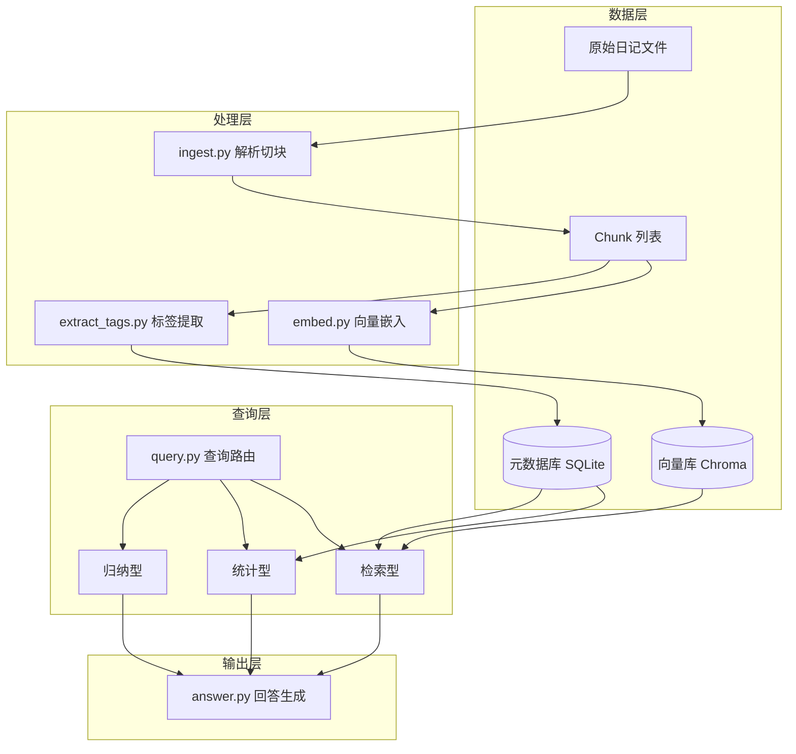

# 第 01 章：项目全景与目标

## 1.1 你要解决什么问题

假设你有一个月日记，约 10 万字。你想问：


| 问题             | 类型  | 难点               |
| -------------- | --- | ---------------- |
| 这个月所有关于吃饭的内容   | 检索型 | 需要找到所有相关片段，不漏不重  |
| 这个月最喜欢做的事情是什么  | 归纳型 | 需要跨多篇日记总结偏好      |
| 这个月有多少次让我感动的瞬间 | 统计型 | 需要准确计数，不能靠 LLM 猜 |


把 ChatGPT 整本日记贴进去不可行：上下文窗口有限、无法持久索引、计数不可靠、无法增量更新。

你需要的是一个**专门的分析系统**。

## 1.2 系统架构总览




核心设计原则：

1. **双层索引**：向量库管语义相似，SQLite 管结构化过滤与计数
2. **查询路由**：不同问题走不同策略，不一律走向量检索
3. **先算后答**：统计类问题由程序算好，再交给 LLM 组织语言
4. **引用溯源**：每条结论标注来源日期


## 1.3 技术选型


### 为什么选这些


| 组件   | 选择                       | 理由                 |
| ---- | ------------------------ | ------------------ |
| 语言   | Python 3.11+             | AI 生态最成熟，上手快       |
| 向量库  | Chroma                   | 轻量、本地、无需服务         |
| 元数据  | SQLite                   | 10 万字量级绰绰有余，零配置    |
| 嵌入模型 | `BAAI/bge-small-zh-v1.5` | 中文效果好，可本地跑         |
| LLM  | Ollama + Qwen2.5         | 日记隐私敏感，优先本地        |
| 框架   | 先不用 LangChain            | 手写 pipeline 才能真正理解 |


### 不选什么（现阶段）

- **Elasticsearch**：10 万字用不上
- **云端 API 做嵌入**：日记原文不宜上传
- **知识图谱**：第一版过度设计，标签字段够用


## 1.4 三类查询的实现思路


### 检索型：「所有关于吃饭的内容」

```
topics 含 "吃饭" OR food_mentions 非空     ← SQLite 过滤
        ∪
向量检索 query="吃饭 餐饮 美食" top_k=50   ← 语义补充
        →
合并去重，按日期排序
```


### 统计型：「感动瞬间有多少次」

```
SELECT COUNT(*) FROM chunk_tags
WHERE is_touching_moment = true
        →
返回计数 + 列表
        →
LLM 仅负责润色表述，不负责计数
```


### 归纳型：「最喜欢做什么」

```
聚合 activities 字段频次 → top 5
        →
每个 activity 取向量检索的相关片段
        →
LLM 归纳：「你最喜欢…，因为…」
```


## 1.5 里程碑规划


| 阶段        | 产出                       | 验收标准                           |
| --------- | ------------------------ | ------------------------------ |
| M1 数据管道   | `ingest.py` 能切块并存 SQLite | 打印 5 条 chunk，日期正确              |
| M2 向量检索   | `embed.py` + Chroma      | 「吃饭」能召回相关片段                    |
| M3 标签提取   | `extract_tags.py`        | 每个 chunk 有 topics/emotions 等字段 |
| M4 查询路由   | `query.py`               | 三类问题都能返回正确结果                   |
| M5 完整 CLI | `main.py`                | 命令行交互式提问                       |


## 1.6 数据格式约定

建议从第一天就统一日记格式。推荐：

```
# 2025-06-15

今天中午和朋友去吃了火锅，辣得我眼泪都出来了，但是很开心。
晚上一个人散步，看到夕阳特别美，突然有点感动...

# 2025-06-16

...
```

每条日记：

- 以 `# YYYY-MM-DD` 标题行开头
- 正文随意，系统负责解析

在 `config.yaml` 中记录格式约定，后续解析器按此实现。

## 动手练习

1. 拿 3–5 天真实日记，整理成上述 Markdown 格式，放入 `data/diary/`
2. 列出你想问的 10 个问题，标注每题属于检索 / 统计 / 归纳哪一类
3. 画一张你自己的系统架构草图，对照 1.2 检查是否有遗漏模块


## 下一章

[第 02 章：RAG 核心概念](02-RAG核心概念.md) —— 理解嵌入、切块、检索、生成的原理。