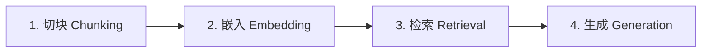
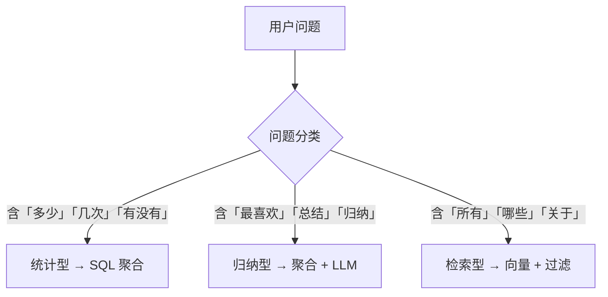

# 正确的第 02 章：RAG 核心概念

## 2.1 什么是 RAG

**RAG**（Retrieval-Augmented Generation，检索增强生成）= **先检索相关文档，再让 LLM 基于检索结果回答**。

```
用户问题 → 检索相关片段 → 拼成 context → LLM 生成回答
```

对比两种极端：


| 方式      | 做法             | 问题              |
| ------- | -------------- | --------------- |
| 纯 LLM   | 把全部日记塞进 prompt | 上下文超限；无法增量；计数不准 |
| 纯关键词搜索  | `grep "吃饭"`    | 漏掉「聚餐」「美食」等同义表达 |
| **RAG** | 检索 + 生成        | 兼顾语义理解与可控性      |


你的日记 RAG 是 RAG 的**扩展版**：检索之外还有结构化标签，用于统计和精确过滤。

## 2.2 核心流程四步




### 第 1 步：切块（Chunking）

把长文档切成短片段。原因：

- 嵌入模型有长度上限（通常 512 token）
- 检索粒度越细，召回越精准
- 便于标注日期等元数据

日记场景的切块策略：

```
第一层：按日记条目（一天一篇）→ 保留 date
第二层：长条目按段落再切 → 每块 300–500 字，重叠 50 字
```

### 第 2 步：嵌入（Embedding）

把文本变成高维向量（一串数字），语义相近的文本向量距离近。

```
"今天中午吃了火锅"  →  [0.12, -0.34, 0.56, ...]   (512维)
"晚上和朋友聚餐"    →  [0.11, -0.31, 0.58, ...]   ← 与上面距离近
"今天加班到很晚"    →  [-0.45, 0.22, -0.11, ...]  ← 距离远
```

常用中文嵌入模型：


| 模型                       | 维度   | 特点         |
| ------------------------ | ---- | ---------- |
| `BAAI/bge-small-zh-v1.5` | 512  | 轻量，本地可跑，推荐 |
| `text-embedding-3-small` | 1536 | 需 API，效果好  |


### 第 3 步：检索（Retrieval）

用户提问也转成向量，在向量库中找最相似的 top_k 个 chunk。

相似度常用**余弦相似度**：

```
similarity = cos(query_vector, chunk_vector)
           = 两向量夹角的余弦值，范围 [-1, 1]，越大越相似
```

### 第 4 步：生成（Generation）

把检索到的 chunk 拼进 prompt，让 LLM 回答：

```
以下是你日记中的相关内容：
[2025-06-15] 今天中午和朋友去吃了火锅...
[2025-06-18] 周末自己做了番茄炒蛋...

用户问题：这个月吃了什么？
请基于以上内容回答，并标注来源日期。
```

## 2.3 向量检索 vs 关键词检索


|                 | 向量检索  | 关键词检索        |
| --------------- | ----- | ------------ |
| 原理              | 语义相似度 | 字面匹配         |
| 「吃饭」能匹配「聚餐」     | ✅     | ❌（除非建同义词表）   |
| 「吃了几次火锅」精确计数    | ❌     | ✅（配合结构化字段更好） |
| 需要 embedding 模型 | ✅     | ❌            |


**结论**：你的系统需要**混合检索**——向量 + 关键词/标签过滤。

## 2.4 为什么需要结构化标签

单靠向量检索解决不了：

```
「感动瞬间有多少次？」  → 向量无法可靠计数
「吃了几次火锅？」      → 需要 food_mentions 字段精确匹配
「最喜欢做什么？」      → 需要 activities 字段做频次聚合
```

因此在向量索引之外，增加一层**结构化标签索引**：

```python
{
  "topics": ["吃饭", "朋友"],
  "activities": ["吃火锅", "散步"],
  "emotions": ["开心", "感动"],
  "food_mentions": ["火锅"],
  "is_touching_moment": true
}
```

这是本项目的**关键差异化**，也是第 06 章的重点。

## 2.5 查询路由

不是所有问题都走向量检索。先判断问题类型：




简单规则示例（第一版够用，后续可用 LLM 分类）（）：

```python
def classify_query(question: str) -> str:
    if any(w in question for w in ["多少", "几次", "多少次", "有没有"]):
        return "statistical"
    if any(w in question for w in ["最喜欢", "总结", "归纳", "最常"]):
        return "summarization"
    return "retrieval"
```

## 2.6 常见误区


| 误区               | 事实                   |
| ---------------- | -------------------- |
| RAG = 向量数据库      | RAG 是流程；向量库只是其中一环    |
| chunk 越小越好       | 太小丢上下文；推荐 300–500 字  |
| embedding 模型越大越好 | 10 万字小数据集，small 模型足够 |
| 所有问题都交给 LLM      | 计数、过滤必须程序完成          |
| 必须先学 LangChain   | 先手写四步流程，理解后再用框架      |


## 2.7 关键术语表


| 术语             | 含义                       |
| -------------- | ------------------------ |
| Chunk          | 切块后的文本片段，检索的最小单位         |
| Embedding      | 文本的向量表示                  |
| Top-k          | 检索返回最相似的前 k 个结果          |
| Metadata       | 附在 chunk 上的结构化信息（日期、标签等） |
| Hybrid Search  | 向量检索 + 关键词/过滤的组合         |
| Context Window | LLM 一次能处理的 token 上限      |


## 动手练习

1. 不运行代码，用手写方式：拿一段 200 字日记，手动切成 2 个 chunk，写出每个 chunk 应带的 metadata
2. 为你在第 01 章列的 10 个问题各标注查询类型（检索/统计/归纳）
3. 思考：「我这个月心情怎么样」属于哪类？需要哪些索引字段？

## 下一章

[第 03 章：环境搭建与项目骨架](03-环境搭建与项目骨架.md) —— 搭建 Python 环境，创建项目目录。