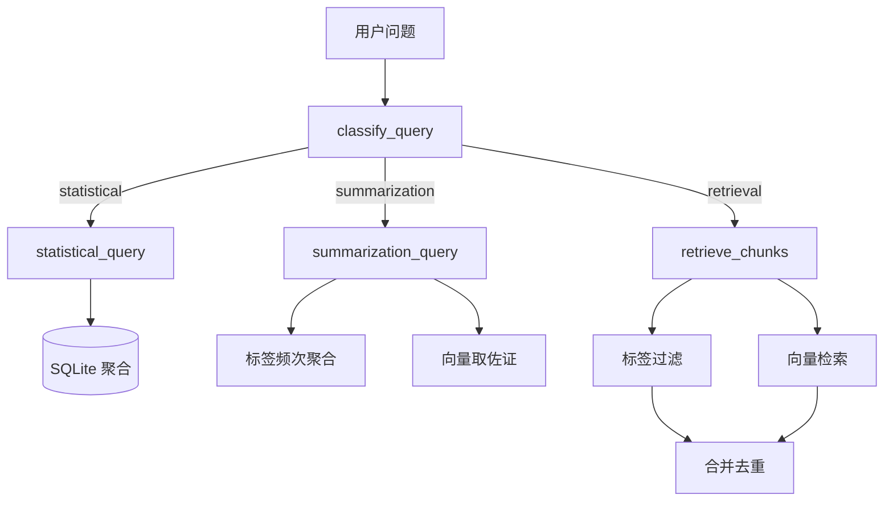

# 第 07 章：查询路由与三类问题

## 7.1 本章目标

实现 `query.py`，根据问题类型自动选择策略：

| 类型 | 示例 | 策略 |
|------|------|------|
| 检索型 | 所有关于吃饭的内容 | 标签过滤 ∪ 向量检索 |
| 统计型 | 感动瞬间有多少次 | SQL 聚合计数 |
| 归纳型 | 最喜欢做的事情 | 字段频次 + 向量补充 + LLM |

## 7.2 问题分类器

第一版用关键词规则，简单可靠：

```python
"""查询路由：分类 → 执行 → 返回结构化结果。"""

import re


def classify_query(question: str) -> str:
    q = question.strip()

    statistical_signals = ["多少", "几次", "多少次", "有没有", "统计", "计数", "总共"]
    if any(s in q for s in statistical_signals):
        return "statistical"

    summarization_signals = ["最喜欢", "最常", "总结", "归纳", "主要", "偏好", "习惯"]
    if any(s in q for s in summarization_signals):
        return "summarization"

    return "retrieval"
```

后续可升级为 LLM 分类，但规则版对明确问题已够用。

## 7.3 检索型实现

### 混合检索：标签过滤 + 向量补充

```python
import json
from src.embed import search_similar
from src.store import get_db


def retrieve_chunks(question: str, top_k: int = 20) -> list[dict]:
    """检索型：标签过滤 + 向量检索，合并去重。"""
    results_by_id = {}

    # 路径 A：从问题推断过滤条件
    tag_filters = infer_tag_filters(question)
    if tag_filters:
        sql_results = filter_by_tags(tag_filters)
        for r in sql_results:
            results_by_id[r["id"]] = r

    # 路径 B：向量语义检索
    vec_results = search_similar(question, top_k=top_k)
    for r in vec_results:
        if r["id"] not in results_by_id:
            results_by_id[r["id"]] = r
        else:
            results_by_id[r["id"]]["score"] = r.get("score", 0)

    # 按日期排序
    merged = sorted(results_by_id.values(), key=lambda x: x.get("date", ""))
    return merged


def infer_tag_filters(question: str) -> dict:
    """从问题推断标签过滤条件。"""
    filters = {}
    if any(w in question for w in ["吃饭", "吃", "美食", "餐厅", "食物"]):
        filters["has_food"] = True
    if any(w in question for w in ["感动", "温暖", "落泪"]):
        filters["is_touching_moment"] = True
    if any(w in question for w in ["朋友", "聚会", "社交"]):
        filters["topics_contains"] = "朋友"
    return filters


def filter_by_tags(filters: dict) -> list[dict]:
    conn = get_db()
    conditions = []
    params = []

    if filters.get("has_food"):
        conditions.append("t.food_mentions != '[]'")
    if filters.get("is_touching_moment"):
        conditions.append("t.is_touching_moment = 1")
    if filters.get("topics_contains"):
        conditions.append("t.topics LIKE ?")
        params.append(f'%"{filters["topics_contains"]}"%')

    where = " AND ".join(conditions) if conditions else "1=1"
    rows = conn.execute(f"""
        SELECT c.id, c.date, c.text, t.topics, t.food_mentions
        FROM chunks c
        JOIN chunk_tags t ON c.id = t.chunk_id
        WHERE {where}
        ORDER BY c.date
    """, params).fetchall()
    conn.close()

    return [{"id": r["id"], "date": r["date"], "text": r["text"]} for r in rows]
```

## 7.4 统计型实现

**原则：先算后答，不让 LLM 猜数字。**

```python
def statistical_query(question: str) -> dict:
    """统计型：SQL 聚合，返回数字 + 明细。"""
    conn = get_db()

    if any(w in question for w in ["感动", "温暖"]):
        count = conn.execute(
            "SELECT COUNT(*) FROM chunk_tags WHERE is_touching_moment = 1"
        ).fetchone()[0]
        details = conn.execute("""
            SELECT c.date, c.text, t.touching_summary
            FROM chunk_tags t
            JOIN chunks c ON c.id = t.chunk_id
            WHERE t.is_touching_moment = 1
            ORDER BY c.date
        """).fetchall()
        conn.close()
        return {
            "type": "statistical",
            "metric": "touching_moments",
            "count": count,
            "details": [dict(d) for d in details],
        }

    if any(w in question for w in ["火锅"]):
        rows = conn.execute("""
            SELECT c.id, c.date, c.text, t.food_mentions
            FROM chunk_tags t
            JOIN chunks c ON c.id = t.chunk_id
            WHERE t.food_mentions LIKE '%火锅%'
        """).fetchall()
        conn.close()
        return {
            "type": "statistical",
            "metric": "hotpot_mentions",
            "count": len(rows),
            "details": [dict(r) for r in rows],
        }

    conn.close()
    return {"type": "statistical", "error": "暂不支持该统计问题"}
```

扩展方式：为更多统计意图添加分支，或抽象为「字段 + 过滤条件」配置。

## 7.5 归纳型实现

```python
from collections import Counter
import json


def summarization_query(question: str) -> dict:
    """归纳型：聚合标签频次 + 取向量相关片段。"""
    conn = get_db()
    rows = conn.execute("""
        SELECT activities, emotions, topics FROM chunk_tags
    """).fetchall()
    conn.close()

    # 聚合 activities 频次
    activity_counter = Counter()
    for row in rows:
        activities = json.loads(row["activities"] or "[]")
        activity_counter.update(activities)

    top_activities = activity_counter.most_common(5)

    # 为 top activity 取向量相关片段作佐证
    evidence = {}
    for activity, _ in top_activities[:3]:
        chunks = search_similar(activity, top_k=3)
        evidence[activity] = chunks

    return {
        "type": "summarization",
        "top_activities": top_activities,
        "evidence": evidence,
        "question": question,
    }
```

归纳的最终自然语言表述交给第 08 章的 `answer.py`。

## 7.6 统一入口

```python
def query(question: str) -> dict:
    """统一查询入口。"""
    qtype = classify_query(question)

    if qtype == "statistical":
        return statistical_query(question)
    elif qtype == "summarization":
        return summarization_query(question)
    else:
        chunks = retrieve_chunks(question)
        return {
            "type": "retrieval",
            "count": len(chunks),
            "chunks": chunks,
        }
```

### 测试

```python
if __name__ == "__main__":
    tests = [
        "这个月所有关于吃饭的内容",
        "感动瞬间有多少次",
        "这个月最喜欢做的事情是什么",
    ]
    for q in tests:
        result = query(q)
        print(f"\nQ: {q}")
        print(f"类型: {result['type']}")
        if result["type"] == "statistical":
            print(f"计数: {result.get('count')}")
        elif result["type"] == "retrieval":
            print(f"召回: {result['count']} 条")
        elif result["type"] == "summarization":
            print(f"Top活动: {result.get('top_activities', [])[:3]}")
```

## 7.7 查询路由流程图

完整结构图（两表字段 + 三类查询如何使用）见：

[figures/chunk表结构与三类查询架构图.md](figures/chunk表结构与三类查询架构图.md)



## 7.8 常见边界情况

| 情况 | 处理 |
|------|------|
| 问题跨类型：「吃饭最多的那天吃了什么」 | 先统计再检索；或拆成两步 |
| 无匹配结果 | 返回空列表 + 提示调整问题 |
| 日期范围：「上周」 | 解析相对日期，加 `WHERE date BETWEEN` |
| 同一 chunk 被两路召回 | 按 id 去重 |

### 日期范围解析（扩展）

```python
from datetime import datetime, timedelta

def parse_date_range(question: str) -> tuple[str, str] | None:
    today = datetime.now().date()
    if "这周" in question or "本周" in question:
        start = today - timedelta(days=today.weekday())
        return start.isoformat(), today.isoformat()
    if "这个月" in question or "本月" in question:
        start = today.replace(day=1)
        return start.isoformat(), today.isoformat()
    return None
```

## 动手练习

1. 实现 `classify_query`，用 10 个问题测试分类是否正确
2. 实现 `retrieve_chunks`，对比纯向量 vs 混合检索的结果
3. 实现 `statistical_query` 的「感动瞬间」分支，核对计数与人工印象
4. 实现 `summarization_query`，看 top activities 是否符合你的真实偏好

## 下一章

[第 08 章：回答生成与引用溯源](08-回答生成与引用溯源.md) —— 把结构化查询结果变成自然语言回答。
