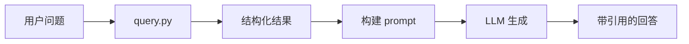

# 第 08 章：回答生成与引用溯源

## 8.1 本章目标

实现 `answer.py`，将 `query.py` 的结构化结果转化为**带日期引用的自然语言回答**。

原则：
- **统计型**：数字由程序给出，LLM 只负责组织语言
- **检索型**：LLM 基于召回 chunk 回答，必须引用来源
- **归纳型**：LLM 基于聚合数据 + 佐证片段归纳

## 8.2 回答生成架构



## 8.3 Prompt 模板

### 检索型

```python
RETRIEVAL_ANSWER_PROMPT = """你是个人日记分析助手。根据以下日记片段回答用户问题。

要求：
1. 仅基于提供的片段回答，不要编造
2. 每条信息标注来源日期，格式 [YYYY-MM-DD]
3. 简洁有条理，可用列表
4. 若片段不足以回答，明确说明

日记片段：
{context}

用户问题：{question}

回答："""
```

### 统计型

```python
STATISTICAL_ANSWER_PROMPT = """你是个人日记分析助手。根据以下统计数据回答用户问题。

要求：
1. 统计数字必须使用提供的 count，不要修改
2. 列举具体事件时标注日期 [YYYY-MM-DD]
3. 语气自然，像朋友在帮你回顾

统计结果：
- 指标：{metric}
- 数量：{count}
- 明细：
{details}

用户问题：{question}

回答："""
```

### 归纳型

```python
SUMMARIZATION_ANSWER_PROMPT = """你是个人日记分析助手。根据以下分析数据归纳用户偏好。

要求：
1. 基于活动频次数据和日记佐证片段归纳
2. 说明「最喜欢」的依据（出现次数 + 具体经历）
3. 标注关键日期 [YYYY-MM-DD]
4. 语气温暖、个人化

活动频次排名：
{top_activities}

相关日记片段：
{evidence}

用户问题：{question}

回答："""
```

## 8.4 构建 Context

```python
"""回答生成：结构化结果 → 自然语言。"""

from openai import OpenAI
from src.query import query
from src.store import load_config


def get_llm_client() -> OpenAI:
    cfg = load_config()["llm"]
    return OpenAI(base_url=cfg["base_url"], api_key=cfg["api_key"])


def format_chunks_context(chunks: list[dict], max_chars: int = 6000) -> str:
    """把 chunk 列表格式化为 prompt context，控制总长度。"""
    lines = []
    total = 0
    for c in chunks:
        line = f"[{c['date']}] {c['text']}"
        if total + len(line) > max_chars:
            lines.append("... (更多内容已省略)")
            break
        lines.append(line)
        total += len(line)
    return "\n\n".join(lines)


def format_statistical_details(details: list[dict], limit: int = 10) -> str:
    lines = []
    for d in details[:limit]:
        summary = d.get("touching_summary") or d.get("text", "")[:80]
        lines.append(f"- [{d['date']}] {summary}")
    if len(details) > limit:
        lines.append(f"... 共 {len(details)} 条，仅显示前 {limit} 条")
    return "\n".join(lines)
```

## 8.5 生成回答

```python
def generate_answer(question: str) -> str:
    result = query(question)
    client = get_llm_client()
    cfg = load_config()["llm"]

    if result["type"] == "retrieval":
        context = format_chunks_context(result["chunks"])
        if not context.strip():
            return "未找到相关日记内容，请尝试换个问法。"
        prompt = RETRIEVAL_ANSWER_PROMPT.format(
            context=context, question=question
        )

    elif result["type"] == "statistical":
        if result.get("error"):
            return f"暂时无法统计：{result['error']}"
        details = format_statistical_details(result.get("details", []))
        prompt = STATISTICAL_ANSWER_PROMPT.format(
            metric=result.get("metric", ""),
            count=result["count"],
            details=details,
            question=question,
        )

    elif result["type"] == "summarization":
        top_str = "\n".join(
            f"- {act}: {cnt} 次" for act, cnt in result.get("top_activities", [])
        )
        evidence_lines = []
        for act, chunks in result.get("evidence", {}).items():
            for c in chunks[:2]:
                evidence_lines.append(f"[{c['date']}] ({act}) {c['text'][:100]}")
        prompt = SUMMARIZATION_ANSWER_PROMPT.format(
            top_activities=top_str,
            evidence="\n".join(evidence_lines),
            question=question,
        )

    else:
        return "未知查询类型"

    response = client.chat.completions.create(
        model=cfg["model"],
        messages=[{"role": "user", "content": prompt}],
        temperature=0.3,
    )
    return response.choices[0].message.content
```

## 8.6 CLI 入口

`main.py`：

```python
"""日记 RAG 命令行入口。"""

import sys
from rich.console import Console
from rich.markdown import Markdown
from src.answer import generate_answer

console = Console()


def main():
    if len(sys.argv) > 1:
        question = " ".join(sys.argv[1:])
        answer = generate_answer(question)
        console.print(Markdown(answer))
        return

    console.print("[bold]个人日记 RAG[/bold] — 输入问题，空行退出\n")
    while True:
        try:
            question = input("你: ").strip()
        except (EOFError, KeyboardInterrupt):
            break
        if not question:
            break
        console.print("\n[dim]思考中...[/dim]")
        answer = generate_answer(question)
        console.print(Markdown(f"\n{answer}\n"))


if __name__ == "__main__":
    main()
```

使用：

```bash
# 交互模式
python main.py

# 单次提问
python main.py "这个月感动瞬间有多少次"
```

## 8.7 引用溯源的重要性

日记 RAG 的核心价值是**可验证**——你能回到原文核对。

好的回答：

```
你这个月有 3 次感动瞬间：

1. [2025-06-15] 晚上散步看到夕阳，心里突然一暖
2. [2025-06-18] 妈妈打来电话说想我了
3. [2025-06-25] 同事默默帮我改了 PPT
```

坏的回答：

```
你这个月大约有 3–4 次感动瞬间，比如看夕阳、和妈妈通话等。
```

后者无法溯源，数字也可能错。

## 8.8 流式输出（可选增强）

```python
def generate_answer_stream(question: str):
    result = query(question)
    # ... 构建 prompt（同上）

    client = get_llm_client()
    cfg = load_config()["llm"]
    stream = client.chat.completions.create(
        model=cfg["model"],
        messages=[{"role": "user", "content": prompt}],
        temperature=0.3,
        stream=True,
    )
    for chunk in stream:
        delta = chunk.choices[0].delta.content
        if delta:
            print(delta, end="", flush=True)
    print()
```

## 8.9 无 LLM 的降级回答

LLM 不可用时，仍可返回结构化结果：

```python
def fallback_answer(result: dict) -> str:
    if result["type"] == "statistical":
        return f"统计：{result['metric']} = {result['count']} 次"
    if result["type"] == "retrieval":
        lines = [f"[{c['date']}] {c['text'][:100]}..." for c in result["chunks"][:5]]
        return "相关片段：\n" + "\n".join(lines)
    return str(result)
```

## 动手练习

1. 实现 `generate_answer`，测试三类问题各 2 个
2. 检查回答中的日期引用是否与数据库一致
3. 实现 `main.py` 交互 CLI，连续问 5 个问题
4. 故意问一个数据库没内容的问题，看降级是否合理

## 下一章

[第 09 章：测试验证与迭代优化](09-测试验证与迭代优化.md) —— 建立测试集，系统评估准确率。
