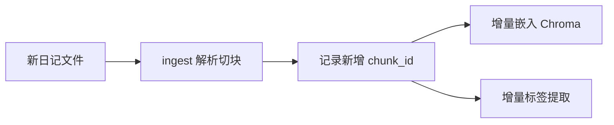

# 第 10 章：增量更新与工程化

## 10.1 本章目标

让系统从「一次性脚本」变成**可持续使用的工具**：

- 新日记写入后自动增量索引
- 统一的 CLI 工作流
- 隐私保护与备份
- 了解后续扩展方向

## 10.2 增量更新流程



### 追踪已处理文件

在 SQLite 中记录处理状态：

```sql
CREATE TABLE IF NOT EXISTS ingest_log (
    source_file TEXT PRIMARY KEY,
    file_hash   TEXT,
    chunk_count INTEGER,
    processed_at TEXT DEFAULT (datetime('now'))
);
```

```python
import hashlib
from pathlib import Path


def file_hash(filepath: Path) -> str:
    return hashlib.md5(filepath.read_bytes()).hexdigest()


def ingest_incremental() -> list[str]:
    """只处理新增或变更的日记文件，返回新增 chunk id 列表。"""
    cfg = load_config()
    diary_dir = resolve_path(cfg["data"]["diary_dir"])
    conn = get_db()

    new_chunk_ids = []
    for filepath in sorted(diary_dir.glob("*.md")):
        fh = file_hash(filepath)
        row = conn.execute(
            "SELECT file_hash FROM ingest_log WHERE source_file = ?",
            (filepath.name,),
        ).fetchone()

        if row and row["file_hash"] == fh:
            continue  # 未变更，跳过

        # 解析并保存（同第 04 章逻辑）
        entries = parse_diary_file(str(filepath), cfg["diary"]["date_pattern"])
        chunks = []
        for entry in entries:
            chunks.extend(entry_to_chunks(entry, ...))

        save_chunks(chunks, conn)
        new_ids = [c.id for c in chunks]
        new_chunk_ids.extend(new_ids)

        conn.execute(
            """INSERT OR REPLACE INTO ingest_log
               (source_file, file_hash, chunk_count)
               VALUES (?, ?, ?)""",
            (filepath.name, fh, len(chunks)),
        )
    conn.commit()
    conn.close()
    return new_chunk_ids
```

### 一键更新命令

```python
# main.py 扩展
def cmd_update():
    """增量更新：新日记 → 嵌入 → 标签。"""
    from src.ingest import ingest_incremental
    from src.embed import index_new_chunks
    from src.extract_tags import extract_tags_for_ids

    print("1/3 导入新日记...")
    new_ids = ingest_incremental()
    if not new_ids:
        print("没有新内容")
        return

    print(f"2/3 嵌入 {len(new_ids)} 个新 chunk...")
    index_new_chunks(new_ids)

    print("3/3 提取标签...")
    extract_tags_for_ids(new_ids)

    print("更新完成")
```

使用：

```bash
python main.py update
python main.py "这周吃了什么"   # 更新后直接提问
```

## 10.3 完整 CLI 设计

```bash
python main.py ingest      # 全量导入（首次）
python main.py index       # 全量嵌入
python main.py tags        # 全量标签提取
python main.py update      # 增量更新（日常用这个）
python main.py test        # 跑测试集
python main.py "你的问题"   # 提问
```

`main.py` 用 `argparse`：

```python
import argparse

def main():
    parser = argparse.ArgumentParser(description="个人日记 RAG")
    parser.add_argument("command", nargs="?", default="chat",
                        help="ingest | index | tags | update | test | 或直接提问")
    args = parser.parse_args()

    commands = {
        "ingest": cmd_ingest,
        "index": cmd_index,
        "tags": cmd_tags,
        "update": cmd_update,
        "test": cmd_test,
    }

    if args.command in commands:
        commands[args.command]()
    else:
        # 当作问题
        answer = generate_answer(args.command)
        console.print(Markdown(answer))
```

## 10.4 隐私与安全

日记是高度隐私数据，注意：

| 措施 | 做法 |
|------|------|
| 本地优先 | Ollama + 本地 embedding，原文不出本机 |
| Git 忽略 | `data/diary/`、`data/diary.db`、`data/chroma/` 加入 `.gitignore` |
| 备份加密 | 定期备份 `data/`，可用加密盘或 zip 密码 |
| API 脱敏 | 若必须用云端 API，人名替换为「朋友A」「家人」 |
| 访问控制 | 数据库文件权限限制为当前用户 |

### 脱敏示例

```python
import re

def desensitize(text: str, names: list[str]) -> str:
    for i, name in enumerate(names):
        text = text.replace(name, f"人物{i+1}")
    return text
```

## 10.5 备份策略

```bash
# 简单备份脚本 backup.sh / backup.ps1
$date = Get-Date -Format "yyyy-MM-dd"
Compress-Archive -Path data/diary.db, data/chroma -DestinationPath "backup/diary_$date.zip"
```

建议每周备份一次。恢复时解压覆盖 `data/` 即可。

## 10.6 性能参考

10 万字量级（约 200 chunk）的预期性能：

| 操作 | 耗时（本地） |
|------|-------------|
| 全量 ingest | < 5 秒 |
| 全量 embed | 1–3 分钟（含模型加载） |
| 全量标签提取 | 30–60 分钟（Qwen2.5-7B） |
| 单次查询 | 2–5 秒 |
| 增量更新 1 篇新日记 | < 1 分钟 |

若扩展到一年 120 万字（~2400 chunk），仍在单机舒适区内。

## 10.7 扩展方向

完成 MVP 后，可按兴趣扩展：

### 短期（1–2 周）

| 扩展 | 价值 |
|------|------|
| 情绪趋势图 | 按日聚合 emotions，可视化心情曲线 |
| 周报/月报自动生成 | 定时跑 summarization，输出 Markdown 报告 |
| 多文件格式支持 | 支持纯 txt、微信导出格式 |

### 中期（1 月）

| 扩展 | 价值 |
|------|------|
| Web UI | Streamlit 或简单 Flask 前端 |
| 时间线视图 | 按日期浏览所有 chunk 和标签 |
| 对比 Letta 记忆架构 | 把日记摘要同步到 Letta agent 的长期记忆 |

### 长期

| 扩展 | 价值 |
|------|------|
| 跨月/跨年分析 | 「今年和去年同期的情绪对比」 |
| 多模态 | 日记中的照片 OCR + 描述索引 |
| 主动提醒 | 「你提到想学吉他 3 次了，要不要开始？」 |

## 10.8 与 Letta 的对比学习

| 维度 | 你的日记 RAG | Letta |
|------|-------------|-------|
| 数据 | 静态文档（日记文件） | 动态对话记忆 |
| 索引时机 | 批量预处理 | 实时写入记忆 |
| 检索触发 | 用户主动提问 | Agent 自动召回 |
| 核心挑战 | 结构化标签 + 统计 | 记忆压缩 + 遗忘策略 |
| 隐私模型 | 完全本地 | 可选本地/云 |

学完本教程后，建议阅读 Letta 的 `AGENTS.md` 和 memory 相关源码，理解「记忆分层」（core memory / archival memory / recall memory）的设计，思考哪些思路可以反哺你的日记系统。

## 10.9 毕业检查清单

完成以下全部项，即 MVP 毕业：

- [ ] `data/diary/` 有至少一周真实日记
- [ ] `python main.py ingest` 成功，chunks 表有数据
- [ ] `python main.py index` 成功，Chroma 可检索
- [ ] `python main.py tags` 成功，chunk_tags 表有数据
- [ ] 检索型问题能返回带日期的相关片段
- [ ] 统计型问题计数与人工核对一致
- [ ] 归纳型问题能给出合理偏好总结
- [ ] `python main.py test` 通过率 > 80%
- [ ] `python main.py update` 增量更新可用
- [ ] 敏感数据已加入 `.gitignore`

## 10.10 推荐后续学习资源

| 主题 | 资源 |
|------|------|
| 嵌入模型原理 | [MTEB 排行榜](https://huggingface.co/spaces/mteb/leaderboard) |
| Chroma 文档 | https://docs.trychroma.com |
| RAG 评估 | RAGAS 框架（进阶） |
| Letta 记忆架构 | `letta/AGENTS.md` + 官方文档 |
| 中文分词与检索 | jieba + BM25 混合检索（进阶） |

---

恭喜完成全部 10 章教学。你已从零搭建了一个能检索、统计、归纳个人日记的 RAG 系统。

回到 [README](README.md) 查看章节索引，或开始实现你的第一个模块：`src/ingest.py`。
