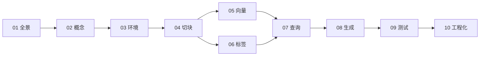

# 个人日记 RAG 系统 · 从零教学

> 目标：用一个月约 10 万字的日记，构建一个能回答「这个月吃了什么」「最喜欢做什么」「感动瞬间有多少次」等问题的本地分析系统。

## 你将构建什么

```
原始日记 (.txt / .md)
    ↓ 解析 & 切块
    ↓ 向量嵌入（语义检索）
    ↓ 结构化标签提取（统计 & 过滤）
    ↓ 查询路由（检索 / 归纳 / 统计）
    ↓ 带引用的自然语言回答
```

最终产物不是聊天机器人，而是**个人日记分析引擎**——能检索、能计数、能归纳，且每条结论可追溯到具体日期。

## 章节导航

| 章 | 文件 | 内容 | 预计学时 |
|----|------|------|---------|
| 01 | [项目全景与目标](01-项目全景与目标.md) | 需求拆解、架构总览、技术选型 | 2h |
| 02 | [RAG 核心概念](02-RAG核心概念.md) | 嵌入、切块、检索、生成；与传统搜索的区别 | 3h |
| 03 | [环境搭建与项目骨架](03-环境搭建与项目骨架.md) | Python 环境、目录结构、依赖、配置文件 | 2h |
| 04 | [日记数据解析与切块](04-日记数据解析与切块.md) | 格式统一、按日期切分、chunk 策略 | 4h |
| 05 | [向量嵌入与语义检索](05-向量嵌入与语义检索.md) | embedding 模型、Chroma、相似度搜索 | 4h |
| 06 | [结构化标签提取](06-结构化标签提取.md) | LLM 打标签、SQLite 存储、字段设计 | 5h |
| 07 | [查询路由与三类问题](07-查询路由与三类问题.md) | 检索型 / 统计型 / 归纳型的实现 | 5h |
| 08 | [回答生成与引用溯源](08-回答生成与引用溯源.md) | prompt 设计、流式输出、来源标注 | 3h |
| 09 | [测试验证与迭代优化](09-测试验证与迭代优化.md) | 测试集、评估指标、prompt 调优 | 3h |
| 10 | [增量更新与工程化](10-增量更新与工程化.md) | 新日记追加、CLI、隐私、扩展方向 | 3h |

**总计约 34 小时**，按每天 2–3 小时计，约 2–3 周可完成 MVP。

## 推荐学习顺序



- **第 5 章与第 6 章可并行**：向量索引和结构化标签互不依赖，都依赖第 4 章的 chunk 数据。
- **每章末尾有「动手练习」**：完成练习再进入下一章，避免只读不做。

## 最终项目结构（预览）

学完所有章节后，你的仓库大致如下：

```
Personal_Rag/
├── My_rag/              ← 本教学文档
├── data/
│   └── diary/           ← 原始日记
├── src/
│   ├── ingest.py        ← 解析 + 切块
│   ├── embed.py         ← 向量嵌入
│   ├── extract_tags.py  ← 标签提取
│   ├── store.py         ← SQLite + Chroma 封装
│   ├── query.py         ← 查询路由
│   └── answer.py        ← RAG 回答
├── config.yaml
├── tests/
│   └── test_queries.yaml
└── main.py              ← CLI 入口
```

## 前置知识

- 基本 Python（函数、类、文件读写）
- 命令行基础（`pip install`、`python main.py`）
- 无需深度学习背景；无需提前了解 LangChain

## 与 Letta 的关系

本仓库中的 `letta/` 是另一个学习参考——Letta 解决的是**智能体记忆管理**（跨会话记住你是谁）。你的日记 RAG 解决的是**静态文档分析与检索**。两者思路相通（持久化 → 索引 → 按需召回），但场景不同。学完本教程后，可对比阅读 Letta 的记忆架构，加深理解。

## 开始学习

从 [第 01 章：项目全景与目标](01-项目全景与目标.md) 开始。
