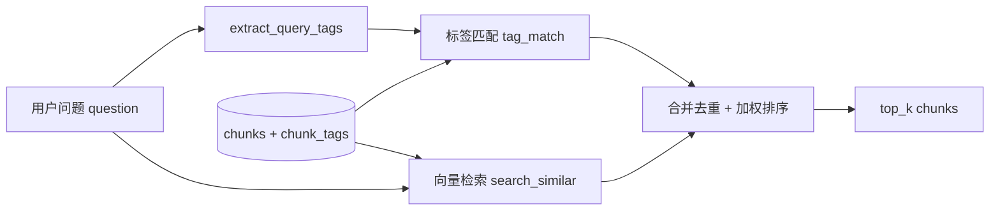
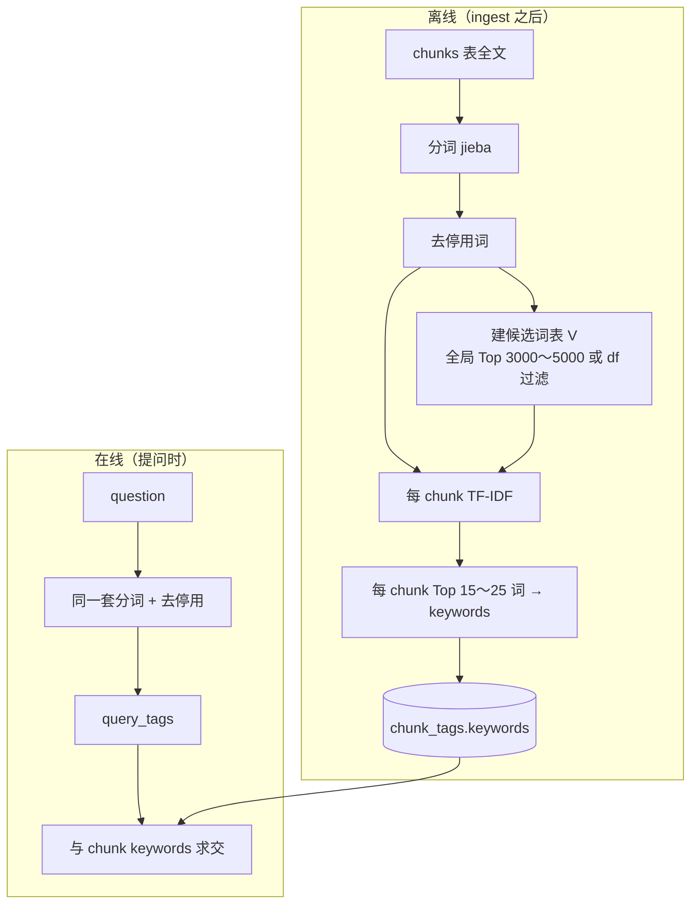

# Version 0.1 · 召回架构方案

面向中研院等大规模日记语料：摈弃问题路由，改用 **统计词标签 + 向量** 并联召回。

范围：仅 **① 摈弃路由** 与 **② Tag 提取** 两块；Agent 聊天、重排、分层摘要等不在本文。

---

## 背景与动机

| 现状（MVP） | 问题 |
|-------------|------|
| `classify_query` 分 retrieval / statistical / summarization | 口语、隐喻、专名问题无法覆盖 |
| `infer_tag_filters` 硬编码「吃饭 / 感动 / 朋友」 | 与楊基振等语料词域完全不匹配 |
| LLM 固定 schema 打标签（topics / food_mentions…） | 需事先假定类别，不可扩展 |

**目标：** 召回层统一为一条链路；标签从 **语料自动统计** 得出，不依赖预定义 ontology。

---

## 一、摈弃问题路由

### 1.1 删除 / 降级的能力

```text
删除作为召回入口：
  classify_query()
  statistical_query()
  summarization_query()
  infer_tag_filters() 中的硬编码词表

保留（可选，不作为主路径）：
  parse_date_range()  →  日后作时间窗过滤 Tool
```

### 1.2 新召回主路径



**原则：**

- 不再根据问题类型走不同 SQL / 不同函数。
- 统计型（「几次」）、归纳型（「最喜欢什么」）由 **上层 Agent / answer** 基于召回到的 chunks 组织回答，不在 `query()` 内分支。
- `query(question)` 统一返回：

```python
result = {
    "chunks": [...],   # 带 id, date, text, score
    "count": len(chunks),
    "query_tags": ["中秋", "開灤", ...],  # 可选，便于调试
}
```

### 1.3 与现有模块的衔接

| 模块 | v0.1 变更 |
|------|-----------|
| `query.py` | 只保留 `retrieve_chunks` + 统一 `query` 入口 |
| `answer.py` | 只消费 `result["chunks"]`，删除对 `type == statistical` 等分支 |
| `main.py test` | 测试集改为「问题 → 应召回日期/关键词」，不再断言 `type` |
| `extract_tags.py` | 新增统计标签路径；LLM 标签路径默认关闭或后置 |

### 1.4 双路召回打分（示意）

```text
score(chunk) = w_vec * vec_score + w_tag * tag_overlap_ratio

tag_overlap_ratio = |query_tags ∩ chunk_tags| / max(|query_tags|, 1)
```

权重建议起步：`w_vec = 0.7`，`w_tag = 0.3`（可写入 `config.yaml` 的 `retrieval` 段）。

---

## 二、Tag 提取（统计词标签）

### 2.1 设计原则

- **不预先指定** tag 全集；tag 由当前语料 **自动发现**。
- **词云思路**：全库统计得到候选词表 V；**每个 chunk 只保留有区分度的词**（TF-IDF Top-K），避免「今天 / 公司」泛标签污染。
- **与向量并联**：标签负责专名、关键词；向量负责语义、隐喻。
- **Phase 1 不用 LLM 打标签**（省 API、可离线、适合先跑 sinica 试集）。

### 2.2 流水线



### 2.3 词表 V 的构建

```python
# 输入：全部 chunk.text
# 输出：vocabulary.json（约 3000～5000 词，可配置）

步骤：
1. 对所有 chunk 分词
2. 去掉停用词（的、了、在、之、也… + 自定义专名保护列表可选）
3. 去掉单字（可选，古文语料可保留部分单字）
4. 按文档频率 df 过滤：df > 80% 的极泛词丢弃（比「Top1000 全贴」更稳）
5. 剩余按总 tf 或 tf-idf 全局排序，取 Top N 作为 V
```

**说明：** 「Top1000 词素」可作为 N 的配置项，但 chunk 侧仍用 **TF-IDF Top-K**，不是「V 里出现就打上」。

### 2.4 每个 chunk 的 tags

```python
# 输入
chunk_text = "今天雖是中秋節…與張小姐一同賞月…"
vocabulary = V  # 来自 2.3

# 输出
keywords = ["中秋", "賞月", "張小姐", "辦公", "天壇", ...]  # Top-K，K≈20
```

存储：

```sql
-- chunk_tags 扩展（v0.1）
ALTER 概念：
  keywords TEXT   -- JSON 数组，统计词标签
  tag_method TEXT -- 'tfidf' | 'llm'（日后）

-- 可选倒排（加速匹配）
CREATE TABLE chunk_term (
    term TEXT,
    chunk_id TEXT,
    weight REAL,
    PRIMARY KEY (term, chunk_id)
);
CREATE INDEX idx_chunk_term_term ON chunk_term(term);
```

### 2.5 问题侧 query_tags

```python
# 输入
question = "1944年中秋节做了什么"

# 输出
query_tags = ["1944", "中秋", "中秋节"]  # 分词后去停用；与 V 求交可选
```

规则与 chunk 侧 **同一套** `tokenize()` + `stopwords`，保证可比性。

### 2.6 标签匹配召回

```python
# 输入
query_tags = ["中秋", "開灤"]
top_k = 20

# 逻辑
1. SELECT chunk_id FROM chunk_term WHERE term IN (...)
2. 按 SUM(weight) 或 交集词数 排序
3. JOIN chunks 取 text, date
4. 与向量 top_k 合并 → 按 1.4 加权
```

### 2.7 与旧 LLM 标签的关系

| 维度 | 旧 schema（v0） | 统计 keywords（v0.1） |
|------|-----------------|------------------------|
| 来源 | LLM 固定 JSON 字段 | jieba + TF-IDF |
| 成本 | 每 chunk 一次 API | 纯本地 |
| 扩展性 | 受 topics 枚举限制 | 随语料自动扩展 |
| 人名 / 专名 | people 字段 | 分词 + 高频专名可进 V |
| 情绪隐喻 | is_touching_moment | 主要靠向量，标签为辅 |

**v0.1 默认只跑统计 tags**；原 LLM `extract_tags_for_chunk` 保留代码但不在 `main.py tags` 默认路径中调用。

---

## 三、配置项（建议写入 config.yaml）

```yaml
retrieval:
  top_k: 20
  w_vector: 0.7
  w_tag: 0.3

tags:
  method: "tfidf"           # tfidf | llm
  vocab_size: 5000          # 候选词表 V 大小
  keywords_per_chunk: 20    # 每 chunk Top-K
  min_df_ratio: 0.02        # 词至少出现在 2% chunk
  max_df_ratio: 0.80        # 出现在 >80% chunk 的词丢弃
  stopwords_file: "data/stopwords_zh.txt"  # 可选
```

---

## 四、实施顺序（不在此版本跑全库）

```text
1. store：chunk_tags.keywords + chunk_term 表
2. scripts/build_keyword_tags.py：离线建 V + 写 tags
3. query.py：删路由，实现 extract_query_tags + tag_match + merge
4. answer.py：统一按 chunks 生成回答
5. 在 diary_sinica / 楊基振 子集上手工验 10 条召回
```

---

## 五、对照：改前 vs 改后

| 项目 | 改前 | v0.1 |
|------|------|------|
| 问题入口 | 三类路由 | 统一 `retrieve_chunks` |
| 标签来源 | LLM 固定 schema | 语料 TF-IDF keywords |
| 标签用途 | 硬编码 filter + 统计 SQL | query_tags ∩ chunk_tags + 向量并联 |
| 适用语料 | sample 短日记 | sinica 等开放域长日记 |

---

## 六、不在 v0.1 范围

- Agent 多轮聊天与 Tool 调用
- 查询改写、BM25、重排
- 日/周摘要与 Memory Graph
- LLM 标签与人名 NER 增强

以上在召回质量验证通过后再迭代。
