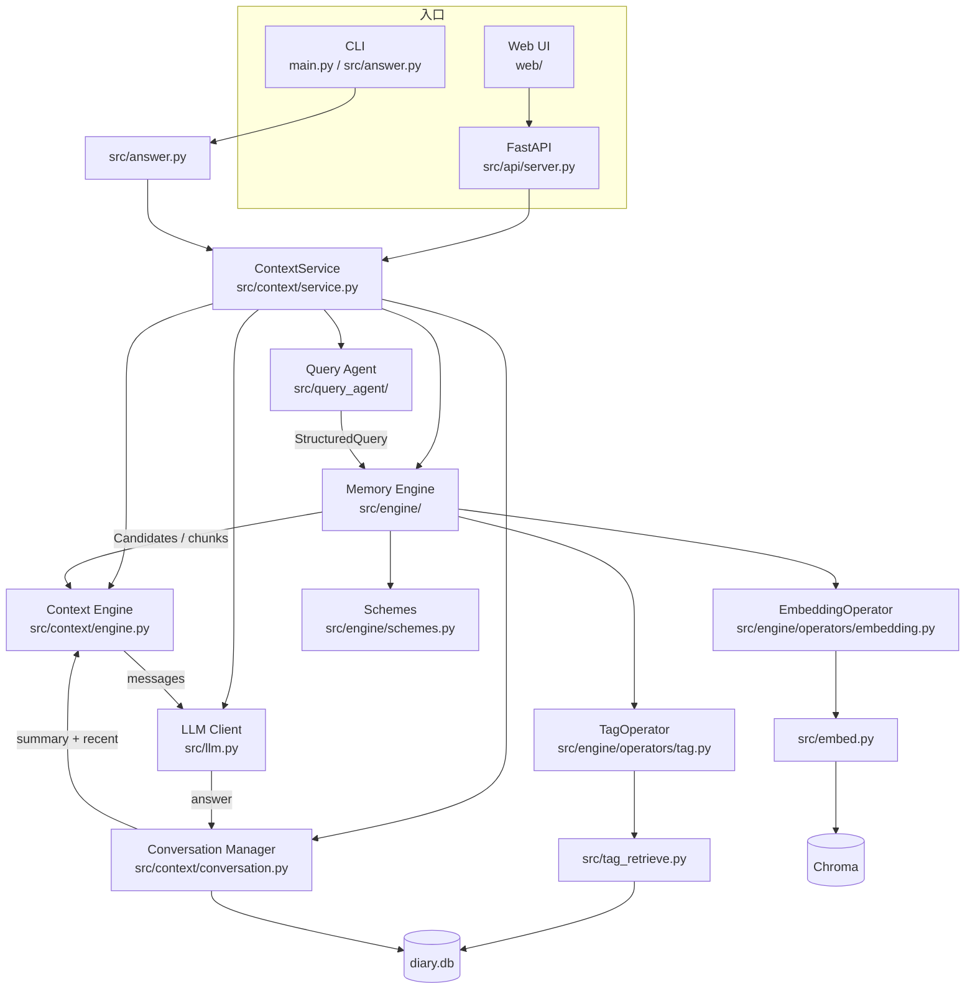
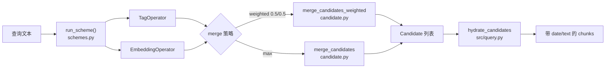
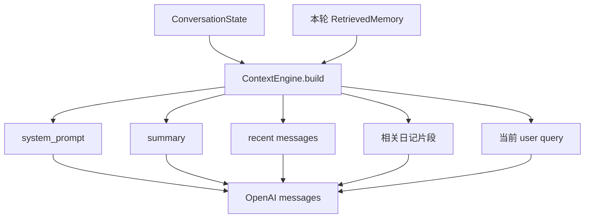
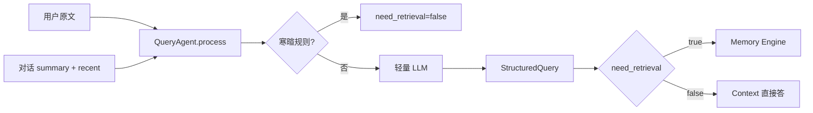
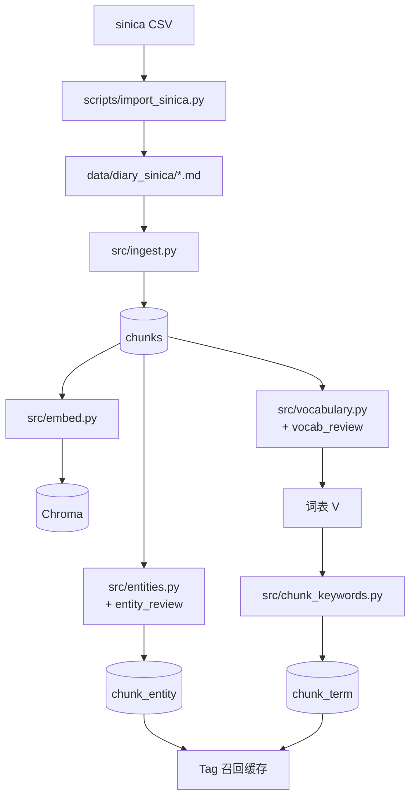

# v0.2 模块架构与源码位置

本文描述当前 My_rag 运行时各模块职责、调用关系与对应源码路径。  
相关专项方案见同目录：`query架构方案.md` / `引擎架构方案.md` / `context_manager架构方案.md` / `前端布局方案.md`。

---

## 1. 总览（在线 Runtime）

一次用户提问的主链路：

```
入口（Web / CLI）
    → ContextService（编排）
        → Query Agent（意图 / 重写 / 是否检索）
        → Memory Engine（按 Scheme 召回）
        → Context Engine（组 Prompt）
        → LLM（回答）
        → Conversation（仅存 user/assistant）
```



---

## 2. 在线模块 ↔ 源码

| 模块 | 职责 | 主要源码 |
|------|------|----------|
| **Web 前端** | ChatGPT 风格多会话 UI；切换检索方案 | `web/index.html`、`web/js/app.js`、`web/css/style.css` |
| **HTTP API** | REST：会话 CRUD、发消息、方案列表 | `src/api/server.py` |
| **CLI / 回答入口** | `main.py chat|web`；封装一轮问答 | `main.py`、`src/answer.py` |
| **ContextService** | 编排一整轮：Query→Retrieve→Context→LLM→Persist | `src/context/service.py` |
| **Query Agent** | 理解意图、重写查询、`need_retrieval`、结构化输出 | `src/query_agent/agent.py`、`models.py` |
| **Memory Engine** | Candidate / Operator / Plan / Scheme；tag↔RAG 合并 | `src/engine/` |
| **检索方案** | `weighted_50_50` / `union_max` / `tag_only` / `embedding_only` | `src/engine/schemes.py`、`config.yaml` → `retrieval.schemes` |
| **Tag 召回** | 实体/关键词倒排打分 | `src/engine/operators/tag.py`、`src/tag_retrieve.py` |
| **向量召回** | Chroma 语义检索 | `src/engine/operators/embedding.py`、`src/embed.py` |
| **Context Engine** | system + summary + recent + 临时 memories → Prompt | `src/context/engine.py`、`tokens.py`、`models.py` |
| **Conversation** | 多会话消息与 LLM summary（不含召回记忆） | `src/context/conversation.py` |
| **LLM** | OpenRouter 等按角色（tags / answer） | `src/llm.py` |
| **配置 / 存储** | YAML + `.env`；SQLite 封装 | `config.yaml`、`src/store.py` |

### Memory Engine 内部



| 文件 | 说明 |
|------|------|
| `src/engine/candidate.py` | `Candidate`；max / 加权合并 |
| `src/engine/operator.py` | Operator 抽象 |
| `src/engine/plan.py` / `executor.py` | 旧 Plan 顺序执行（仍可用） |
| `src/engine/registry.py` | 按名创建 Operator；读 `retrieval.plan` |
| `src/engine/schemes.py` | 命名方案入口（前端切换走这里） |
| `src/engine/operators/tag.py` | Tag 算子 |
| `src/engine/operators/embedding.py` | Embedding 算子 |
| `src/query.py` | hydrate、召回 JSON 落盘、遗留查询入口 |

### Context 层内部



| 文件 | 说明 |
|------|------|
| `src/context/service.py` | 一轮对话编排 |
| `src/context/engine.py` | Prompt 组装；LLM 摘要压缩 |
| `src/context/conversation.py` | SQLite：`conversations` / `conversation_messages` / `retrieval_traces` |
| `src/context/models.py` | `Message` / `RetrievedMemory` / `BuiltContext` |
| `src/context/tokens.py` | Token 预算切分 |

### Query Agent



| 文件 | 说明 |
|------|------|
| `src/query_agent/agent.py` | 理解 / 重写 / 降级 |
| `src/query_agent/models.py` | `StructuredQuery` |
| `data/last_query.json` | 调试输出（可配） |

---

## 3. 离线流水线 ↔ 源码

离线把日记建成「正文 + 向量 + tag 缓存」，在线只读库。



| 步骤 | 脚本 / 模块 | 写入 |
|------|-------------|------|
| CSV → md | `scripts/import_sinica.py` | `data/diary_sinica/` |
| 切块入库 | `src/ingest.py`、`python main.py ingest` | `chunks`、`ingest_log` |
| 向量索引 | `src/embed.py`、`python main.py index` | `data/chroma/` |
| 词表 V | `scripts/build_vocabulary.py` / `build_vocabulary_only.py` | `vocabulary.json`、`lexicon.db` |
| 关键词 | `scripts/build_chunk_keywords.py`、`src/chunk_keywords.py` | `chunk_term`、`chunk_tags.keywords` |
| 实体 | `scripts/build_chunk_entities.py`、`src/entities.py` | `chunk_entity`、全局 entities |
| 一键重建 | `scripts/build_offline_cache.py` | 上述全套 |
| 覆盖率检查 | `scripts/check_db_status.py` | 只读打印 |

辅助：`src/tokenize.py`（分词）、`src/lexicon_db.py`（词表库）、`src/extract_tags.py`（旧版 LLM 结构化 tags，非 v0.2 Tag 召回主路径）。

---

## 4. 数据落点

| 存储 | 路径 / 表 | 谁写 / 谁读 |
|------|-----------|-------------|
| 日记正文 chunk | `data/diary.db` → `chunks` | ingest 写；query hydrate / embed 读 |
| Tag 缓存 | `chunk_entity`、`chunk_term`、`chunk_tags` | 离线脚本写；`tag_retrieve` 读 |
| 向量 | `data/chroma/` | embed 写；EmbeddingOperator 读 |
| 词表 / 停用词 | `data/lexicon.db`、`vocabulary.json`、`stopwords_zh.txt` | vocabulary / review 写 |
| 对话 | `conversations`、`conversation_messages` | ConversationManager |
| 调试 JSON | `data/last_retrieval.json`、`last_context.json`、`last_query.json` | 各层调试落盘 |
| 配置 | `config.yaml` + `.env` | 全局 |

---

## 5. 目录速查

```
My_rag/
├── main.py                 # CLI：ingest / index / chat / web
├── config.yaml             # 检索方案、Context、LLM…
├── web/                    # 前端静态页
├── scripts/                # 离线建库 / 检查
├── data/
│   ├── diary_sinica/       # 楊基振全文 md
│   ├── diary.db            # chunks + tags + conversations
│   ├── chroma/             # 向量
│   └── lexicon.db          # 词表库
├── src/
│   ├── api/                # FastAPI
│   ├── query_agent/        # Query Agent
│   ├── engine/             # Memory Retrieval Engine + schemes
│   ├── context/            # ContextService / Engine / Conversation
│   ├── answer.py           # 问答入口封装
│   ├── query.py            # hydrate + 召回 JSON
│   ├── tag_retrieve.py     # Tag 打分
│   ├── embed.py / ingest.py / llm.py / store.py
│   └── vocabulary / entities / chunk_keywords …
└── doc/version0.2/         # 本文件与各专项方案
```

---

## 6. 与专项文档的对应

| 文档 | 覆盖模块 |
|------|----------|
| `query架构方案.md` | `src/query_agent/` |
| `引擎架构方案.md` | `src/engine/`、`tag_retrieve`、`embed` |
| `context_manager架构方案.md` | `src/context/` |
| `前端布局方案.md` | `web/`、`src/api/` |
| **本文** | 全局关系 + 源码索引 |
