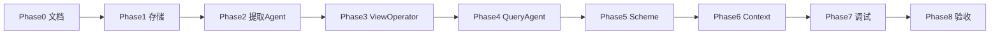

# v0.3 实施路线图

> 愿景见 [`项目架构.md`](项目架构.md)。本文是可执行阶段划分与兼容策略。

## 1. 目标

在 **不改变在线主链路形态** 的前提下，引入 Memory View：

```
Query Agent → Memory Engine → Context Engine → LLM
```

增量能力：

| 层级 | v0.2 | v0.3 |
|------|------|------|
| 写入 | Chunk → Chroma(chunk) | Chunk → Extraction → View → Chroma(views) |
| 检索 | tag + embedding | + **view** Operator |
| Query | rewritten_query | + query_representation + embedding_query |
| Context | chunk 正文 | views + 原文证据 |

## 2. 阶段与依赖



| Phase | 内容 | 产出 | 依赖 |
|-------|------|------|------|
| 0 | 接口约定 | 本文 + 02–08 文档 | 无 |
| 1 | 存储层 | memory_views 表、diary_views Chroma | 0 |
| 2 | 写入流水线 | memory_extraction 模块、build 脚本 | 1 |
| 3 | ViewOperator | operators/view.py、hydrate 扩展 | 1,2 |
| 4 | Query Agent | StructuredQuery 扩展 | 0 |
| 5 | Scheme | tag_view_weighted 等 | 3,4 |
| 6 | Context | RetrievedMemory 扩展、Prompt 块 | 3 |
| 7 | 调试 | last_query/retrieval JSON、Web scheme | 5,6 |
| 8 | 验收 | 测试集、迁移、回滚 | 全部 |

Phase 3 与 Phase 4 可并行开发，合并前以 `StructuredQuery` v0.3 字段为准（见 05 文档）。

## 3. 兼容策略

### 3.1 在线入口不变

- `ContextService.chat()` / Web API 签名不改
- 默认 scheme 初期仍为 `weighted_50_50`（零行为变化）
- 验收通过后切换默认 → `tag_view_weighted`

### 3.2 StructuredQuery 向后兼容

v0.2 字段全部保留；新增字段可选，缺省时 fallback：

- `embedding_query` 空 → 用 `rewritten_query`
- `query_representation` 空 → ViewOperator 不设 view_type filter

### 3.3 Operator 输出不变

仍输出 `Candidate(chunk_id, score, source)`；View 细节放 `meta.matched_views`。

### 3.4 刻意不做（v0.3.x / v0.4）

- PostgreSQL / Qdrant 迁移
- Neo4j Memory Graph
- Memory Evolution 自动更新用户模型
- LangGraph 全链路重写
- 独立 Memory Reasoning Agent（由 Answer LLM + 富 context 承担）

## 4. 里程碑

| 里程碑 | 验收标准 |
|--------|----------|
| M1 存储就绪 | memory_views 表 + diary_views 可 count |
| M2 可提取 | 单 chunk 产出 3–6 views，写入 DB + Chroma |
| M3 可检索 | ViewOperator 对抽象 query 返回 chunk 候选 |
| M4 全链路 | Query → tag_view_weighted → Context 含 views |
| M5 上线 | 默认 scheme 切换 + 08 测试集通过 |

## 5. 相关文档

- [02-数据模型与存储.md](02-数据模型与存储.md)
- [03-写入流水线.md](03-写入流水线.md)
- [04-ViewOperator设计.md](04-ViewOperator设计.md)
- [05-QueryAgent改造.md](05-QueryAgent改造.md)
- [06-Context与Reasoning.md](06-Context与Reasoning.md)
- [07-Scheme与配置.md](07-Scheme与配置.md)
- [08-验收与迁移.md](08-验收与迁移.md)
