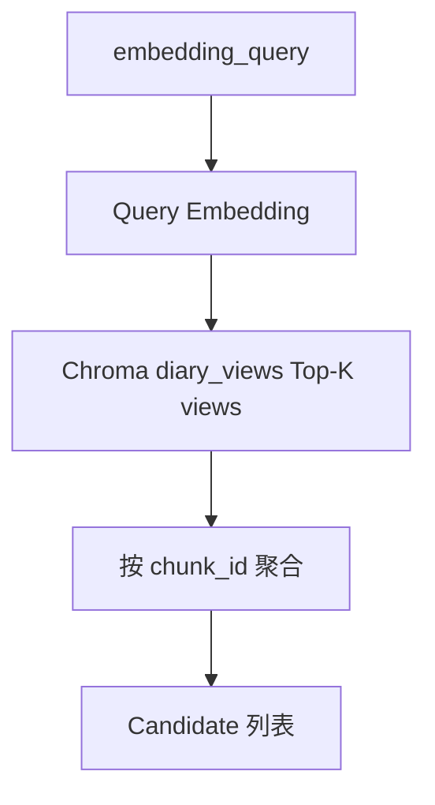

# v0.3 ViewOperator 设计

## 1. 职责

对 **Memory View** 做 ANN 检索，按 **chunk_id 聚合** 后输出 `Candidate` 列表，供 Scheme 与其他 Operator 合并。

## 2. 接口

```python
class ViewOperator(Operator):
    name = "view"

    def execute(
        self,
        query: str,
        candidates: list[Candidate],
        *,
        structured: StructuredQuery | None = None,
    ) -> list[Candidate]:
        ...
```

### 查询文本

优先级：

1. `structured.embedding_query`
2. `structured.rewritten_query`
3. 入参 `query`

### 过滤（Chroma where）

来自 `structured.query_representation`：

- `view_type_hints` → `view_type IN (...)`
- `time_range.start` / `time_range.end` → `date >= / <=`

无 hints 时不设 type 过滤。

## 3. 检索流程



参数：

- `view_top_k`：ANN 层召回 view 数，默认 `top_k * 3`（至少 30）
- `chunk_top_k`：聚合后 chunk 数，默认 `retrieval.top_k`

## 4. chunk 聚合策略（默认）

同 chunk 多条 view 命中时：

```
chunk_score = max(view_score)
```

`matched_views` 保留 Top-3 view（按 score 降序）写入 `Candidate.meta`：

```python
{
  "matched_views": [
    {"view_id": "...", "view_type": "growth", "content": "...", "score": 0.82},
    ...
  ]
}
```

## 5. 与 embedding Operator 区别

| | embedding | view |
|--|-----------|------|
| 索引对象 | chunk 原文 | Memory View 语义表示 |
| 擅长 | 字面/主题相似 | 抽象成长、价值观、Future Query |
| Collection | diary_chunks | diary_views |

两路 **互补**，v0.3 不删除 embedding。

## 6. hydrate 扩展

`hydrate_candidates` 读取 `Candidate.meta.matched_views`，输出：

```json
{
  "id": "chunk_id",
  "date": "...",
  "text": "chunk 原文",
  "score": 0.75,
  "source": "view",
  "matched_views": [...]
}
```

## 7. 源码

- `src/engine/operators/view.py`
- `src/embed.py` → `search_views()`
- `src/engine/registry.py` 注册 `"view"`

## 8. 空库降级

`diary_views.count() == 0` 时返回空列表，不抛错；warn 日志提示运行 `build_memory_views.py`。
