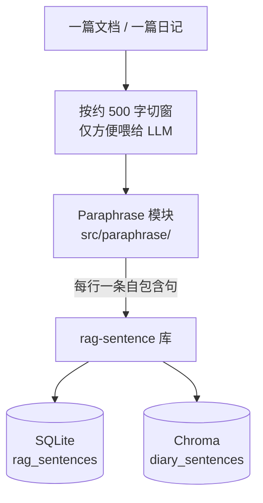
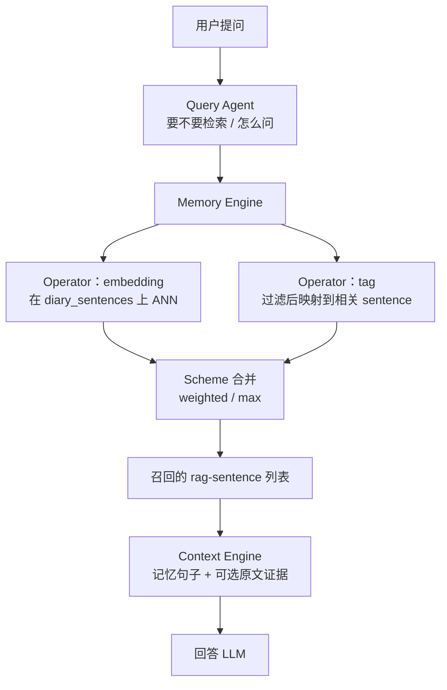
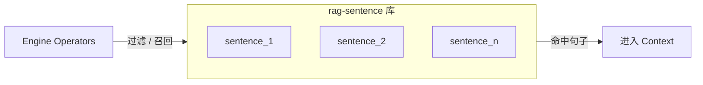
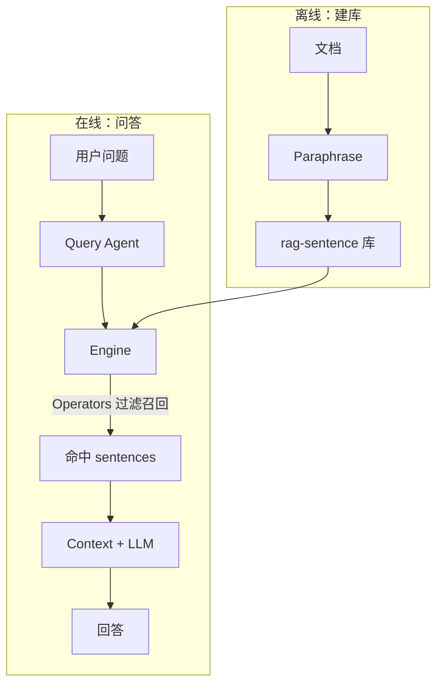

# v0.4 项目架构图

## 核心理解（先看这个）

一篇文档进入项目后的数据主线是：

```text
文档
  → Paraphrase（改写成若干 rag-sentence）
  → 建立 rag-sentence 库（SQLite + Chroma）
  → Engine 用不同 Operator 在 sentence 库上过滤 / 召回
  → Context + LLM 回答
```

**检索与过滤的对象始终是 rag-sentence**，不是原始 chunk 正文。  
Chunk（约 500 字）只是 paraphrase 时的切窗中间态，以及回答时可选挂上的「原文证据」。

---

## 1. 数据进入项目之后（离线建库）



| 步骤 | 做什么 | 产出 |
|------|--------|------|
| 切窗 | 长文切开，便于单次 LLM 改写 | 临时 chunk（可入库作证据父节点） |
| Paraphrase | 按 `rag-sentence.md` 改写 | 多条 rag-sentence |
| 建库 | 落库 + 向量化 | **可被 Engine 检索的 sentence 库** |

命令：`ingest` → `sentences` → `index`（或 `update` 增量）。

> **前瞻（未实现）**：在线召回拟升级为 Query Agent ReAct 中枢 + Grep/RAG 工具，见 [`../version0.5/01-QueryAgent中枢与召回工具草案.md`](../version0.5/01-QueryAgent中枢与召回工具草案.md)。

---

## 2. 查询时（在线 Runtime）

Engine **不直接吃原文**，而是在已经建好的 **rag-sentence 库** 上跑 Operator：





---

## 3. 端到端一张图



要点：

1. **先有库，后有 Engine** —— Engine 消费的是 paraphrase 之后的 sentence 库。  
2. **Operator 作用在 sentence 上** —— embedding 直接搜 sentence；tag 是辅助过滤，最终仍落到 sentence。  
3. **Chunk 不是检索基元** —— 只服务「改写输入窗口」和「回答时原文证据」。

---

## 4. 和实现细节的关系（避免误解）

当前实现里 Tag 仍先在 chunk 的实体/关键词表上打分，再**展开成该 chunk 下的 sentences**。这是标签尚未迁到 sentence 级的权宜之计，**不改变产品语义**：对外召回单元仍是 rag-sentence。

| 概念 | 角色 |
|------|------|
| 文档 | 原始输入 |
| Chunk（500 字） | paraphrase 切窗 + 证据父节点 |
| **rag-sentence** | **库与检索的基元** |
| Engine Operator | 对 sentence 库做过滤 / 召回 |
| Context | 把命中句子（+ 证据）塞进 Prompt |

---

## 5. 模块位置

| 阶段 | 模块 | 路径 |
|------|------|------|
| 改写 | Paraphrase | `src/paraphrase/` |
| 句子库 | SQLite / Chroma | `rag_sentences`、`diary_sentences` |
| 召回 | Engine | `src/engine/`（tag / embedding） |
| 编排 | ContextService | `src/context/service.py` |
| 问答 | Context + LLM | `src/context/engine.py`、`src/llm.py` |

专项说明：`01-rag-sentence架构.md`、`02-写入流水线.md`、`03-Engine与Scheme.md`。
