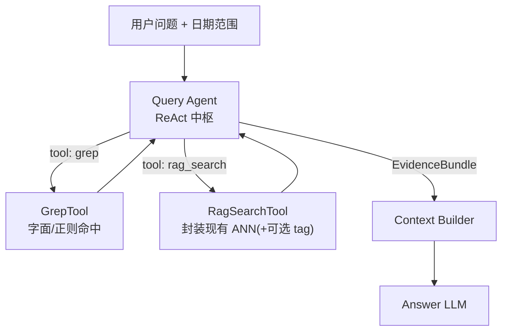

# Query Agent 中枢与召回工具 · 架构草案

> 状态：**P0 已落地**（`query_agent.mode: react`）· **后续主方案见** [`02-Guide预选池Judge召回架构计划.md`](./02-Guide预选池Judge召回架构计划.md)（拟取代本文的打捞式 ReAct）  
> 范围：仅在线 Runtime 召回编排；不改动 Extract / ingest / paraphrase 写入主线。  
> 动机：固定 Scheme 召回偏「死」；专名场景需要 Grep；模糊回忆需要 RAG；顺序应由 Agent 按题决策。

---

## 0. 一句话

**Query Agent 成为 ReAct 中枢：自行决定调用哪些召回工具（Grep / RAG / …），多轮观察后再决定是否足够回答；最终仍以 chunk（或等价证据单元）交给 Context + Answer LLM。**

---

## 1. 相对 v0.4 的问题与目标

### 1.1 现状（v0.4 Runtime）

```text
用户问题
  → QueryAgent（改写 1~3 主题）
  → 固定 Scheme（embedding / tag / …）
  → hydrate → Context → Answer
```

痛点：

| 问题 | 表现 |
|------|------|
| 专名漏召 | 「Alice / 黄金之国」等字面实体，向量可能漂，Tag 又重又不全 |
| 通路写死 | 不论问题形态都走同一 Operator 顺序 |
| 无反馈环 | 召回一次即答，无法「先搜名字、不够再语义补」 |

### 1.2 目标

1. **Grep 工具**：百万字尺度下，对关键词 / 专名做字面（或轻正则）匹配——快、准、可解释。  
2. **RAG 工具**：封装现有 embedding（及可选 tag）语义召回。  
3. **Query Agent = 中枢**：分析问题 → 选工具 → 看结果 → ReAct 是否继续 → 汇总证据 → 交 Answer。  
4. **前端日期范围**仍为每轮外部约束，作为**所有工具的公共 filter**，不由 Agent 覆盖 UI。

非目标（本草案不做）：

- 开放文件系统 / 任意代码执行  
- 用 Agent 改写库内日记  
- 取代离线 paraphrase；检索基元仍可以是 rag-sentence，交付仍可以是 chunk  

---

## 2. 目标 Runtime 总览

```text
用户问题 + date_from/date_to（可选）+ conversation
        │
        ▼
┌──────────────────────────────────────┐
│         Query Agent（ReAct 中枢）      │
│  Think → Act(tool) → Observe → …     │
│  直到：够答 / 达步数预算 / 确认无证据   │
└───────────────┬──────────────────────┘
                │ EvidenceBundle（去重后的 chunks + 命中说明）
                ▼
┌──────────────────────────────────────┐
│  Context Builder（窗口对话 + summary   │
│  + 本轮证据 + 可选 prior 召回）         │
└───────────────┬──────────────────────┘
                ▼
         Answer LLM → 用户
```



与 v0.4 的关系：

- **Memory Engine / Scheme / Operator** → 降级为 `rag_search` 工具内部实现（可保留加权、embedding_only 等）。  
- **QueryAgent 改写主题** → 变为 ReAct 中的一步（可调用 `rag_search(themes=[…])`），不再是唯一入口。  
- **hydrate** → 各工具输出统一成「可交付证据」，再合并。

---

## 3. 工具契约（最小集）

所有工具共享：

```text
common_filters = {
  date_from?: "YYYY-MM-DD",
  date_to?:   "YYYY-MM-DD",
}
```

（完全来自本轮前端 / API，Agent 不可擅自改成「全库」若用户已限定范围——可允许 Agent *收窄* 子区间，不允许 *放宽*。）

### 3.1 `grep`

**用途**：专名、地点、独特短语、用户原话中的关键词。

| 字段 | 说明 |
|------|------|
| 输入 | `terms: string[]`（1~N）；可选 `mode: substring \| exact`；`top_k`；`common_filters` |
| **匹配对象** | **只扫 `chunks.text`（原文）**，不扫 rag-sentence（改写句字面不准） |
| 输出 | `hits[]`: `{ chunk_id, date, snippet, matched_terms, score }` |
| 交付 | 整段 chunk 正文作为证据 |

### 3.1.1 Agent 第一步：问题分析（强制）

进入任何工具调用前，Agent **必须先分析**用户问题，复杂问题拆成子需求并标注通路，例如：

> Alice是我这段时间十分重要的人，我记得和她一起在学校度过了很多快乐的时光

| 子需求 | 工具 | 参数例 |
|--------|------|--------|
| 专名 / 地点字面 | `grep` | `terms=["Alice","学校"]` |
| 「一起度过快乐的时光」等软语义 | `rag_search` | `themes=["与某人在学校共度的愉快回忆"]` |

分析产出写入 `tool_trace` 的 `analyze` 步，再按计划或 ReAct 续跑。

### 3.2 `rag_search`

**用途**：模糊回忆、主题、情绪、事件类型（「快乐的时光」「那段低落」）。

| 字段 | 说明 |
|------|------|
| 输入 | `query` 或 `themes: string[]`；`scheme?`（默认 embedding_only）；`top_k`；`common_filters` |
| 内部 | 现有 EmbeddingOperator（+ 可选 Tag）→ hydrate |
| 输出 | 与现 retrieval 对齐的 chunk 列表 + matched_sentences |

### 3.3 （可选后续）`tag_search` / `stats`

Tag 不再作为默认主通路；需要时再注册为第三工具。统计类问题可另开 `count` 工具，本草案不展开。

### 3.4 统一证据合并

```text
EvidenceBundle = {
  chunks: [{ id, date, text, score, sources: ["grep"|"rag"], matched: [...] }],
  tool_trace: [{ tool, args, n_hits, note }],
  enough: bool,          # Agent 自判或规则辅助
  stop_reason: string,
}
```

合并规则建议：同 `chunk_id` 取 max score；`sources` 并集；Grep 命中可对专名 chunk 加权。

---

## 4. Query Agent（ReAct）行为

### 4.0 工具形态（实现约定）

**不使用** LangChain / LlamaIndex 等框架注册工具。  
工具 = **普通 Python 函数**（`src/tools/`），由轻量 `registry` 按名字分发：

```text
agent 决定 {tool, args}
  → call_tool(name, **args)   # 纯函数
  → 结构化 dict 返回给 agent
```

### 4.1 强制第一步：问题分析（可拆解）

在任何工具调用之前，Agent **必须先分析**用户问题，输出结构化计划，例如：

```json
{
  "need_retrieval": true,
  "analysis": "问题含专名 Alice、地点学校，以及模糊的『快乐时光』",
  "parts": [
    { "channel": "grep", "terms": ["Alice", "学校"], "reason": "专名/地点宜字面匹配原文" },
    { "channel": "rag", "themes": ["与 Alice 在学校共度的愉快时光"], "reason": "快乐时光未必原文原词，需语义补" }
  ]
}
```

复杂问题允许拆成多 part；简单问题可只有 grep 或只有 rag。

### 4.2 循环

```text
state = { question, filters, evidence=[], step=0 }
analysis = LLM_analyze(question)          # 强制第一步
execute parts from analysis (grep / rag)
loop while step < max_steps:
  thought = LLM(观察证据摘要 + 是否够答)
  if thought.decision == "answer": break
  if thought.decision == "grep" | "rag_search":
    evidence ⊕= tool(...)
  step += 1
return EvidenceBundle
```

### 4.2 决策启发式（写进系统提示，非硬编码死路）

| 问题信号 | 倾向 |
|----------|------|
| 明确人名 / 地名 / 书名号 / 独特专名 | 先 `grep` |
| 「那段时间 / 那种感觉 / 类似的事」 | 先 `rag_search` |
| 专名 + 模糊修饰（Alice + 快乐时光） | Grep 收骨架 → 不够再 RAG 补 |
| Grep 已覆盖可答要点 | 停止，勿硬开 RAG |
| 两轮后仍空 | 换词 Grep 或改写主题 RAG；再空则 `enough=false` 交给 Answer 诚实说 |

### 4.3 预算（必须配置化）

| 项 | 建议默认 |
|----|----------|
| `max_tool_steps` | 3~5 |
| 每工具 `top_k` | Grep 20 / RAG 5（可与现 `retrieval.top_k` 对齐） |
| 进入 Context 的 chunk 上限 | 与现 `memory_max_items` 对齐 |
| 单轮墙钟 / token | 可配上限，超时强制 stop |

### 4.4 与 Answer 的分工

| 角色 | 职责 |
|------|------|
| Query Agent | 只负责「找齐证据」与 tool_trace；可产出短 `retrieval_summary` |
| Answer LLM | 只根据 EvidenceBundle + 会话上下文生成对用户回复；**不**再私自调召回工具（第一版） |

---

## 5. 与现有模块映射

| 现有 | 草案中的位置 |
|------|----------------|
| `src/query_agent/` | 升级为 ReAct 中枢（prompt + 状态机 + tool registry） |
| `src/engine/*` Scheme/Operator | `rag_search` 内部 |
| `src/embed.search_similar` | RAG 后端；日期 where 继续用 |
| 新建 `src/tools/grep.py`（名可再定） | Grep 后端 |
| `hydrate_candidates` | RAG 出口；Grep 出口做同类聚合 |
| `ContextService.handle_turn` | QueryAgent.process 换成「跑 ReAct → bundle」再 build_context |
| 前端 `date_from` / `date_to` | 注入 `common_filters` |
| Tag 管线 | 可选工具或暂缓 |

写入侧（extract → ingest → sentences → index）**不变**。

---

## 6. 数据流示例

**问题**：Alice 是我这段时间十分重要的人，我记得和她一起在学校度过了很多快乐的时光。  
**过滤**：用户选了 `2024-01-01` ~ `2024-12-31`。

```text
Step1 Think: 专名 Alice + 地点「学校」+ 软需求「快乐时光」
Step1 Act:   grep(terms=["Alice", "学校"], date_from, date_to)
Step1 Obs:   12 hits → 聚合 4 chunks（含 Alice 多段）

Step2 Think: 有 Alice 骨架，但「快乐」未必字面出现；需语义补
Step2 Act:   rag_search(themes=["与 Alice 在学校的愉快回忆"], …)
Step2 Obs:   5 chunks，与 Grep 去重后共 6 chunks

Step3 Think: 证据足够描述「重要 + 共同时光」→ answer
→ EvidenceBundle → Context → Answer
```

若问题是「我最近为什么总觉得空虚？」——无强专名 → Step1 直接 `rag_search`。

---

## 7. 风险与对策

| 风险 | 对策 |
|------|------|
| 延迟 / 费用升 | 步数预算；小模型做 ReAct、大模型做 Answer（可选） |
| Grep 同名歧义 | 日期过滤 + 第二轮 RAG 收窄；命中列表带 date |
| Agent 乱调工具 | 严格 JSON schema；只允许注册工具 |
| 上下文膨胀 | Evidence 进 Context 前截断；只留 snippet + 必要 chunk |
| 与旧 Scheme UI | Web「scheme」可变为「偏好提示」或隐藏；默认全权交 Agent |

---

## 8. 建议实现分期（仍不写代码，仅排序）

| 期 | 内容 | 验收 |
|----|------|------|
| P0 | 分析优先 + `grep(chunk)` + `rag_search` 纯函数；ReAct 中枢 | Alice 类题能拆 Grep/RAG；证据够停 |
| P1 | 前端展示 tool_trace；预算与收窄日期 | 可调试、可配置 |
| P2 | 可选 FTS 加速 / tag 工具 | 大规模库延迟可接受 |

---

## 9. 配置（已落地）

```yaml
query_agent:
  enabled: true
  mode: "react"          # react | rewrite
  llm_role: "tags"
  max_tool_steps: 4
  tools:
    grep:
      top_k: 20           # 只扫 chunks.text
    rag_search:
      top_k: 5
      default_scheme: "embedding_only"
```

回退旧改写通路：`mode: rewrite`。

---

## 10. 结论

- **Grep（chunk 原文）+ RAG 工具化**，由 **Query Agent ReAct 中枢**先分析再选路。  
- **不使用** LangChain 等框架；工具为 `src/tools/` 纯函数 + `call_tool` 分发。  
- **日期范围仍来自前端**；写入与 sentence 库形态不变；Engine 收进 `rag_search`。
