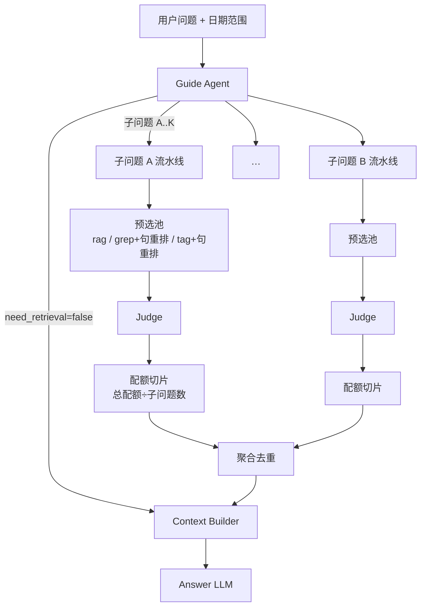

# Guide → 预选池 → Judge · 召回架构计划

> 状态：**实现中（config `query_agent.mode: guide`）**  
> 范围：在线 Runtime **召回编排大改**；不改动 Extract / ingest / paraphrase **写入**主线（继续生产 rag-sentence）。  
> 关系：取代现行 `query_agent.mode: react` 的「多轮打捞」机制（见 `01-QueryAgent中枢与召回工具草案.md`）。Context Builder / Answer LLM 接口形态尽量保持「最终仍交 chunk 证据」。  
> 代码入口：`src/query_agent/guide_agent.py` · `ContextService` 在 `mode=guide` 时调用。

---

## 0. 一句话

**一次 Guide 定计划 → 每子问题独立宽召入预选池（句级打分）→ 轻量 Judge 精筛 → 配额均分后聚合 → ContextBuilder。**  
不再使用 ReAct「缺了再捞、看运气」的多轮工具循环。

---

## 1. 为何大改

### 1.1 现行问题（react）

```text
用户问题 → ReAct（分析 ↔ grep/rag 多轮）→ merge 截断 top_k≈5 → Context → Answer
```

| 问题 | 表现 |
|------|------|
| 打捞式 | 路径不固定，步数少像碰运气，步数多又贵 |
| 决策与取证耦合 | 「够不够」与「搜什么」缠在同一多轮 LLM |
| 配额混乱 | 中间可捞很多，最终仍砍到约 5；@tag 等硬通道难插入 |
| 难调难解释 | 失败时分不清是分析、工具还是合并截断 |

### 1.2 目标

1. **计划式宽召 + 精筛**：召回哲学从「摸索」改为「先宽后窄」。  
2. **子问题独立并行**：复杂题拆开，各跑完整流水线，配额均分后聚合。  
3. **统一句级证据**：预选与 Judge 都以 **rag-sentence** 为相似度与判定单元；chunk 携带「胜出句」metadata。  
4. **显式 `@tag` 硬通道**：用户手动标注优先于 grep/rag。  
5. **可配置硬顶**：避免全量匹配 / 全量进 Judge 撑爆性能与窗口。

### 1.3 非目标（本计划不做）

- 开放文件系统 / 任意代码执行  
- 用 Agent 改写库内日记  
- 无 `@` 时仅因专名碰巧等于 tag 名而自动召回（v1 **忽略**）  
- 替换离线 paraphrase；rag-sentence 仍由现有写入管线产生  

---

## 2. 目标 Runtime 总览

```text
用户问题 + date_from/date_to（可选）+ conversation
        │
        ▼
┌──────────────────────────────────────┐
│  Guide Agent（一次分析，固定 JSON）    │
│  · need_retrieval                    │
│  · 拆子问题（≤N）                     │
│  · 显式 @tag 标记（规则解析为主）      │
│  · 每子问题：grep terms / rag themes │
└───────────────┬──────────────────────┘
                │
        无需召回 ──→ ContextBuilder（无本轮日记证据）
                │
                ▼ 需要召回
┌──────────────────────────────────────┐
│  对每个子问题（并行、彼此独立）：        │
│    预选池 → Judge → 本子问题配额切片   │
└───────────────┬──────────────────────┘
                │
                ▼
┌──────────────────────────────────────┐
│  聚合去重 → EvidenceBundle            │
│  → ContextBuilder → Answer LLM       │
└──────────────────────────────────────┘
```



---

## 3. Guide Agent

### 3.1 职责（一次 LLM 调用）

| 分析项 | 说明 |
|--------|------|
| 是否需要召回 | 闲聊 / 纯澄清 → `need_retrieval=false`，跳过后续 |
| 是否多层 | 是则拆成若干**简单子问题**（并行） |
| 是否含 tag | **以显式 `@Tag名` 为准**（规则解析 + Guide 可复述）；无 `@` 不自动联想 tag |
| 检索计划 | 每子问题给出 grep 关键词、rag 主题 |

### 3.2 约束

| 项 | v1 约定 |
|----|---------|
| 子问题数 | 硬顶 **2～3**（建议默认 max=3） |
| 每子问题 rag themes | **1～3**；禁止「不限个数」 |
| `@tag` 解析 | 对用户原文做 mention 解析 → 匹配 `user_tags.name`；多 tag **均分**后续 tag 路名额 |
| 日期 | `date_from/to` 仍为公共 filter，Guide **不可放宽** UI 范围 |
| 输出 | **固定 JSON schema**（便于预选池硬编码执行） |

### 3.3 输出草案（示意）

```json
{
  "need_retrieval": true,
  "analysis": "一句话",
  "subquestions": [
    {
      "id": "sq1",
      "text": "改写后的简单问题",
      "grep_terms": ["Alice"],
      "rag_themes": ["与 Alice 在学校相处的愉快时光"],
      "tag_ids": ["tag_xxx"],
      "tag_names": ["Alice"]
    }
  ]
}
```

`tag_ids` 建议由**规则解析写入**后交给 Guide 校验/沿用，避免仅靠模型「猜有没有 tag」。

---

## 4. 子问题独立流水线

### 4.1 原则

对复杂问题 `ABC`：

1. 拆成 `A`、`B`、`C`  
2. **各自完整**跑：预选池 → Judge → 本路配额  
3. **彼此独立、可并行**  
4. 最后 **聚合** 再进 ContextBuilder  

### 4.2 配额均分

设全局本轮最终证据预算为 `K_final`（建议默认 **15**，可配置）。

```text
每子问题配额 k_i = floor(K_final / N) 或均分后余数给前若干子问题
例：K_final=15，N=3 → 各 5
```

子问题变多 → 每路更少，**总预算不变**。

### 4.3 聚合去重

- 同一 `chunk_id` 被多个子问题选中：**只保留一条**，合并 `subquestion_ids` / `sources`  
- 配额占用：**只占一格**（避免重复占满窗口）  

---

## 5. 预选池（每子问题）

### 5.1 三路召回

| 路 | 做法 | 目标规模 |
|----|------|----------|
| **RAG** | 现有 sentence ANN（按 themes/query）→ 聚合成 chunk | top **20** chunk |
| **Grep** | 对 `chunks.text` 字面匹配 → **硬顶 M**（按 **日期最近** 保留）→ 匹配集内对 **rag-sentence** embedding 重排 → top **20** chunk | ≤20 |
| **Tag** | `@tag` 绑定 chunk 集（非再全库 grep 人名）→ 过大同样按日期硬顶 → 集内 **rag-sentence** embedding 重排 → top **20** chunk | ≤20 |

三路去重后，单子问题预选池理想上界约 **60**（实际常更少）。  
多个子问题各自 Judge，**不**先混成一个大池再统一判定。

### 5.2 硬顶规则

- Grep / Tag 候选集超过 `M`（建议 **100～200**，可配）：**按 `date` 降序保留最近 M 条**，再做句级重排。  
- 专名命中通常 ≪ M；泛词靠硬顶保护性能，语义面由并行 RAG 路补。  

### 5.3 句级打分与胜出句（核心契约）

与现有「检索基元 = rag-sentence、交付 = chunk」对齐：

1. **相似度计算在 rag-sentence 上**，不对整段 chunk 正文直接 embedding（Grep/Tag 重排与纯 RAG 均如此）。  
2. **chunk 得分** = 该 chunk 下属各 sentence 得分的 **max**。  
3. **胜出句 metadata**（必带）至少包括：  
   - `winning_sentence_id`  
   - `winning_sentence_text`（或短摘）  
   - `score`  
   - `source` ∈ `{rag, grep, user_tag}`（多源则 `sources[]`）  
   - `subquestion_id`  

纯 RAG 路：ANN 已在 sentence 上；hydrate/聚合时同样保留 **得分最高句** 为胜出句。

### 5.4 跨路不可比

预选阶段 **不要** 用 raw score 跨 rag/grep/tag 统一排序；去重时合并 `sources`，排序与名额交给 Judge + 来源优先级规则。

---

## 6. Judge Agent（每子问题）

### 6.1 职责

- **轻量模型**  
- 输入：预选池中每条候选的 **胜出 rag-sentence** + 日期 + 来源（**不喂 chunk 全文**）  
- 输出：哪些候选与**本子问题**相关（id 列表 / 0-1 / 分数）  

### 6.2 名额与优先级（规则层）

设本子问题配额为 `k_i`：

1. 取 Judge 判定为相关的集合 `S`  
2. 若 `|S| ≤ k_i`：全部保留  
3. 若 `|S| > k_i`：按来源优先级截断  

**优先级（高 → 低）：`user_tag` > `grep` > `rag`**

同层内可用胜出句 embedding 分或 Judge 置信度排序。

> Judge 负责「是否相关」；**条数与来源优先级在规则层完成**，避免模型既判相关又暗自凑满名额。

### 6.3 性能

- 仅胜出句 → 约几十条短文本，适合轻量模型  
- 可选：分批判定；可选规则粗滤后再进模型  

---

## 7. `@tag` 专项

| 项 | v1 |
|----|----|
| 触发 | 仅显式 `@Tag名` |
| 解析失败 | 明确提示或记入 debug；不静默当普通字面 |
| 多 tag | **均分** tag 路名额（再进入该子问题预选/配额逻辑） |
| 与人物 | 人物背后即 user_tag；`@人名` 解析到对应 tag 即可，无第二通路 |
| 无 `@` | **忽略**「问题里碰巧出现 tag 名」的软召回 |

Tag 路语义：高置信 **候选池**，不是替代 grep/rag 补漏；补漏仍由同子问题的 grep/rag 路完成。

---

## 8. 与 Context / Answer 的衔接

```text
各子问题配额切片 → 聚合去重 → EvidenceBundle
  → ContextBuilder（窗口对话 + summary + 本轮证据 + 可选 prior）
  → Answer LLM
```

- 本轮证据建议默认 **`K_final ≈ 15`**（可配；相对旧 `retrieval.top_k=5` 放宽，相对 20 满 memories 更稳）。  
- 证据展示建议带来源与胜出句，便于 Answer「命中理由」与调试（`last_retrieval` / `last_context`）。  
- `memory_max_items`、token budget 需与 `K_final` 一并复盘，避免长 chunk 顶满 memories。  

无需召回时：Guide 直接跳到 ContextBuilder，行为与现网「陪聊」一致。

---

## 9. 建议默认参数（可配置）

| 参数 | 建议默认 | 说明 |
|------|----------|------|
| `max_subquestions` | 3 | Guide 拆题上限 |
| `themes_per_subquestion` | 1～3 | |
| `pool.rag_top_k` | 20 | |
| `pool.grep_match_cap` M | 150 | 匹配集按日期最近硬顶 |
| `pool.grep_rerank_top_k` | 20 | 集内句重排后 chunk 数 |
| `pool.tag_cap` / `tag_rerank_top_k` | 同 grep | 绑定集硬顶 + 句重排 |
| `K_final` | 15 | 全局最终证据条数 |
| `k_i` | `K_final / N` | 每子问题均分 |
| 来源优先级 | tag > grep > rag | |

试跑时可先用 `K_final=12～15`，观察 `last_context.json` 是否频繁截断 memories 再调。

---

## 10. 模块边界（实现时）

| 模块 | 职责 | 备注 |
|------|------|------|
| `mention` / tag 解析 | `@` → tag_id | 规则，非 LLM |
| Guide Agent | 一次分析 JSON | 新 prompt；可取代 react 分析步 |
| Candidate Pool | 三路召回 + 句级 max + 胜出句 | 复用 embedding ANN、grep SQL、`list_chunks_for_tag` |
| Judge Agent | 轻量相关判定 | 新 prompt；输入仅胜出句 |
| Quota merge | 均分、优先级、跨子问题去重 | 纯规则 |
| ContextService | 换编排入口，下游 Context/Answer 尽量不动 | |

**退役（或降级开关）：** `ReactQueryAgent` 多轮 `call_tools` 循环；`query_agent.mode: react` 作为过渡期 fallback 可暂留。

**保留：** rag-sentence 写入、Chroma sentence 集合、hydrate 思路（改为强制胜出句字段）、ContextEngine、日期 filter。

---

## 11. 分阶段落地建议

| 阶段 | 内容 | 验收 |
|------|------|------|
| **P0** | Guide JSON + 单子问题预选池（rag + grep 句重排）+ Judge + `K_final` | 无 `@` 主路径可答；debug JSON 可见胜出句 |
| **P1** | 多子问题并行 + 配额均分 + 聚合去重 | 复杂题拆分稳定；总条数 ≈ K_final |
| **P2** | `@tag` 路 + 优先级 tag>grep>rag | 显式 @ 时 tag 证据稳定进 Answer |
| **P3** | 参数打磨、旧 react 开关移除、文档与前端说明 | 延迟/质量可接受 |

---

## 12. 风险与缓解

| 风险 | 缓解 |
|------|------|
| Guide 拆错题 | 限制 N≤3；debug 展示子问题；可后续加「用户可见拆解」 |
| Grep 泛词爆量 | 日期硬顶 M；并行 RAG 补语义 |
| Judge 误杀 / 误放 | 只看胜出句降低噪声；优先级保 tag；阈值可调 |
| 多子问题延迟 | 并行预选；Judge 轻量 + 短输入 |
| 证据变多顶满 Context | `K_final` 与 token budget 联调 |

---

## 13. 决议摘要（讨论已对齐）

1. **废除**打捞式 ReAct 主路径，改为 **Guide → 预选池 → Judge**。  
2. **子问题完全独立**跑全流程，**配额均分**后聚合进 ContextBuilder。  
3. 预选三路；Grep/Tag 先硬顶（**最近日期**）再 **rag-sentence** 重排；chunk 分 = max 句分并 **标记胜出句**。  
4. Judge 只看胜出句；超出配额按 **tag > grep > rag**。  
5. `@tag` 仅显式；多 tag 均分；无 `@` 不软匹配。  
6. 参数可配；建议 `K_final≈15`，每路预选约 20，匹配硬顶 M≈150。  

---

## 14. 文档状态

- 本文：v0.5 **新召回主方案**草案。  
- `01-QueryAgent中枢与召回工具草案.md`：描述已落地的 **react** 方案；实现本计划后应标注为 **历史 / fallback**，避免双源真理。  

**下一步（需明确授权后再做）：** 按 P0 改 `ContextService` 编排、新增 Guide/Judge prompt 与预选池模块，并保留 `mode: react` 开关直至 P3。
